# Sentinel流量控制

## 1.导学

### 1.1.软件环境

- 系统：windows10

- 开发工具：IntelliJ IDEA、maven
- JDK：1.8+

### 1.2.技术储备要求

- spring、springmvc、springboot、springcloud、阿里云、zookeeper

### 1.3.适合人群 

- 初学者
  - Sentinel简介
  - Sentinel入门
- 开发者
  - Sentinel简介
  - Sentinel入门
  - Sentinel高级
- 测试、运维
  - Sentinel简介
  - Sentinel入门
- 技术爱好者、性能优化人员、架构师
  - Sentinel原理

### 1.4.课程内容

- **Sentinel简介**
  - 流量控制&熔断降级介绍
  - Sentinel介绍
- **Sentinel入门**
  - Sentinel初体验
  - Sentinel流控降级入门
  - Sentinel定义资源的方式
- **Sentinel高级**
  - Sentinel和SpringCloud整合
  - Sentinel对Feign的支持
  - Sentinel对Spring Cloud Gateway的支持
  - Sentinel流量控制实现
  - Sentinel熔断降级实现
  - Sentinel系统自适应保护实现
  - Sentinel授权控制实现
  - Sentinel动态规则扩展实现
- **Sentinel原理**
  - Sentinel主要功能设计理念
  - Sentinel的工作机制

## 2.Sentinel简介

### 2.1.流量控制&熔断降级介绍

#### 2.1.1.流量控制简介

拿旅游景点举个示例，每个旅游景点通常都会有最大的接待量，不可能无限制的放游客进入，比如故宫每天只卖八万张票，超过八万的游客，无法买票进入，因为如果超过八万人，景点的工作人员可能就忙不过来，过于拥挤的景点也会影响游客的体验和心情，并且还会有安全隐患；只卖N张票，这就是一种限流的手段。


流量控制在网络传输中是一个常用的概念，它用于调整网络包的发送数据。在网络传输时，任意时间到来的请求往往是随机不可控的，而系统的处理能力是有限的。我们需要根据系统的处理能力对流量进行控制。

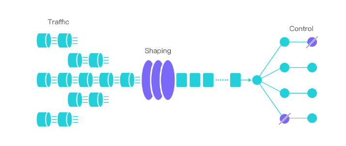

#### 2.1.2.熔断降级简介

在调用系统的时候，如果调用链路中的某个资源出现了不稳定，最终会导致请求发生堆积，如下图：


而熔断降级就可以解决这个问题，所谓的熔断降级就是当检测到调用链路中某个资源出现不稳定的表现，例如请求响应时间长或异常比例升高的时候，则对这个资源的调用进行限制，让请求快速失败，避免影响到其它的资源而导致级联故障。

#### 2.1.3.流量控制&熔断降级实现方案

**Hystrix**

​		**主页地址：**https://github.com/Netflix/Hystrix/

​		Hystrix源自Netflix API团队于2011年开始的弹性工程工作。2012年，Hystrix不断发展和成熟，Netflix内的许多团队都采用了它。如今，每天在Netflix上通过Hystrix执行数以千亿计的线程隔离和数以千计的信号隔离调用。这大大提高了正常运行时间和弹性。

**Resilience4j**

​		**主页地址：**https://github.com/resilience4j/resilience4j

​		Resilience4j是受Netflix Hystrix启发的轻量级容错库，但专为Java 8和函数式编程而设计。轻巧，因为该库仅使用Vavr，而Vavr没有任何其他外部库依赖项。相比之下，Netflix Hystrix对Archaius具有编译依赖性，而Archaius具有更多外部库依赖性。

**Sentinel**

​		**主页地址：**https://github.com/alibaba/Sentinel

​		Sentinel 是阿里巴巴出品的面向分布式服务架构的轻量级流量控制组件，主要以流量为切入点，从限流、流量整形、熔断降级、系统负载保护等多个维度来保障微服务的稳定性。

**竞品对比**

|                | Sentinel                                                   | Hystrix               | resilience4j                     |
| -------------- | :--------------------------------------------------------- | --------------------- | -------------------------------- |
| 隔离策略       | 信号量隔离（并发线程数隔离）                               | 线程池隔离/信号量隔离 | 信号量隔离                       |
| 熔断降级策略   | 基于响应时间、异常比率、异常数                             | 基于异常比率          | 基于异常比率、响应时间           |
| 实时统计实现   | 滑动窗口                                                   | 滑动窗口              | Ring Bit Buffer                  |
| 动态规则配置   | 支持多种数据源                                             | 支持多种数据源        | 有限支持                         |
| 扩展性         | 多个扩展点                                                 | 插件的形式            | 接口的形式                       |
| 基于注解的支持 | 支持                                                       | 支持                  | 支持                             |
| 限流           | 基于 QPS，支持基于调用关系的限流                           | 有限的支持            | Rate Limiter                     |
| 流量整形       | 支持预热模式、匀速器模式、预热排队模式                     | 不支持                | 简单的 Rate Limiter 模式         |
| 系统自适应保护 | 支持                                                       | 不支持                | 不支持                           |
| 控制台         | 提供开箱即用的控制台，可配置规则、查看秒级监控、机器发现等 | 简单的监控查看        | 不提供控制台，可对接其它监控系统 |

### 2.2.Sentinel介绍

#### 2.2.1.Sentinel简介

**Sentinel概述**

Sentinel 是阿里巴巴出品的面向分布式服务架构的轻量级流量控制组件，主要以流量为切入点，从限流、流量整形、熔断降级、系统负载保护等多个维度来保障微服务的稳定性。

**主页地址：**https://github.com/alibaba/Sentinel

**Sentinel历史**

- 2012 年，Sentinel 诞生，主要功能为入口流量控制。
- 2013-2017 年，Sentinel 在阿里巴巴集团内部迅速发展，成为基础技术模块，覆盖了所有的核心场景。Sentinel 也因此积累了大量的流量归整场景以及生产实践。
- 2018 年，Sentinel 开源，并持续演进。
- 2019 年，Sentinel 朝着多语言扩展的方向不断探索，推出 C++ 原生版本，同时针对 Service Mesh 场景也推出了 Envoy 集群流量控制支持，以解决 Service Mesh 架构下多语言限流的问题。
- 2020 年，推出 Sentinel Go 版本，继续朝着云原生方向演进。

**Sentinel组成**

Sentinel 的使用主要分为两个部分:

- **核心库：**主要指Java 客户端，不依赖任何框架/库，能够运行于 Java 7 及以上的版本的运行时环境，同时对 Dubbo / Spring Cloud 等框架也有较好的支持。
- **控制台：**控制台主要负责管理推送规则、监控、集群限流分配管理、机器发现等。

#### 2.2.2.Sentinel特征

Sentinel 具有以下特征:

- **丰富的应用场景**：Sentinel 承接了阿里巴巴近 10 年的双十一大促流量的核心场景，例如秒杀（即突发流量控制在系统容量可以承受的范围）、消息削峰填谷、集群流量控制、实时熔断下游不可用应用等。
- **完备的实时监控**：Sentinel 同时提供实时的监控功能。您可以在控制台中看到接入应用的单台机器秒级数据，甚至 500 台以下规模的集群的汇总运行情况。
- **广泛的开源生态**：Sentinel 提供开箱即用的与其它开源框架/库的整合模块，例如与 Spring Cloud、Dubbo、gRPC 的整合。您只需要引入相应的依赖并进行简单的配置即可快速地接入 Sentinel。
- **完善的 SPI 扩展点**：Sentinel 提供简单易用、完善的 SPI 扩展接口。您可以通过实现扩展接口来快速地定制逻辑。例如定制规则管理、适配动态数据源等。

#### 2.2.3.Sentinel特性


#### 2.2.4.Sentinel开源生态


#### 2.2.5.Sentinel的相关概念

**资源**

资源是 Sentinel 的关键概念。它可以是 Java 应用程序中的任何内容，例如，由应用程序提供的服务，或由应用程序调用的其它应用提供的服务，甚至可以是一段代码。只要通过 Sentinel API 定义的代码，就是资源，能够被 Sentinel 保护起来。大部分情况下，可以使用方法签名，URL，甚至服务名称作为资源名来标示资源。

**规则**

规则指的是围绕资源的实时状态设定的规则，可以包括流量控制规则、熔断降级规则以及系统保护规则。所有规则可以动态实时调整。

#### 2.2.6.Sentinel的优势

- 友好的控制面板
- 支持实时监控。
- 支持多种限流。支持QPS限流，线程数限流以及多种限流策略。
- 支持多种降级模式，支持按平均返回时间降级，按多种异常数降级，按异常比率降级等。
- 方便扩展开发，支持SPI模式对chain进行扩展。
- 支持链路的关联，可以实现按链路统计限流，系统保护，热门资源保护等等。

## 3.Sentinel入门

### 3.1.Sentinel初体验

为了方便理解Sentinel，Sentinel提供了公网Demo来帮助我们快速熟悉Sentinel，步骤分为两步，具体如下：

- 下载公网Demo
- 开通阿里云AHAS控制台

#### 3.1.1.开通阿里云的AHAS控制台

阿里云的AHAS控制台需要注册登陆到阿里云平台并进行开通才能使用，具体如下：

阿里云地址：https://www.aliyun.com

**1.注册**


注册之后需要进行实名认证

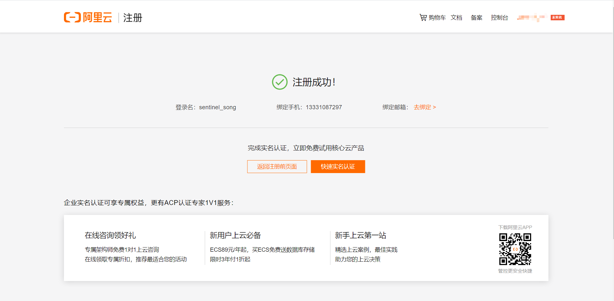

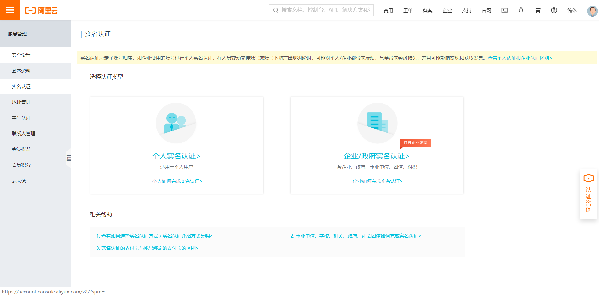

如果是个人推荐“个人实名认证”，如果是企业推荐“企业/政府实名认证”。这里选择个人实名认证。

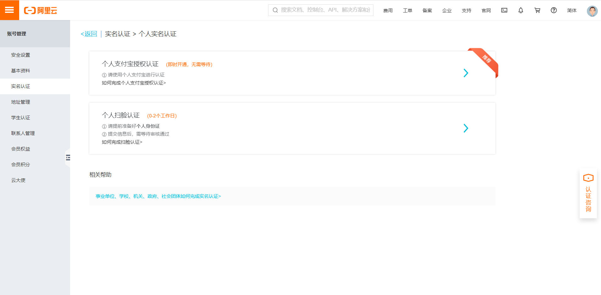

个人实名认证有“个人支付宝授权认证”和“个人扫脸认证”，这里选择“个人支付宝授权认证”，认证速度会比较快。

**2.登录**

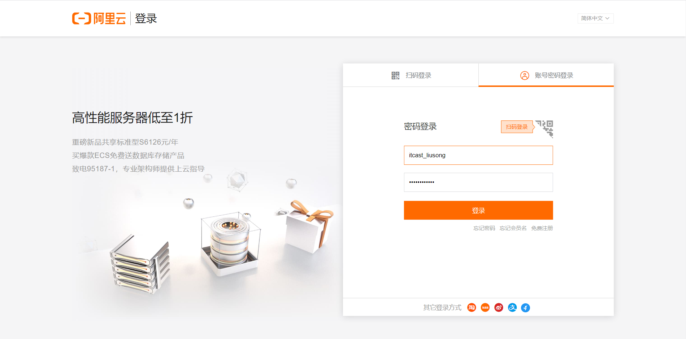

登录之后，可以进行绑定邮箱，也可以选择暂不绑定。

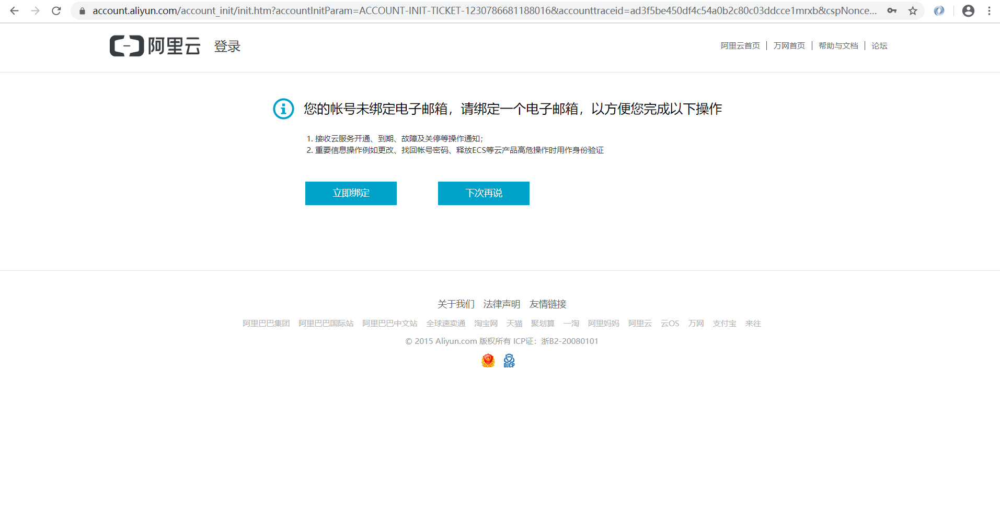

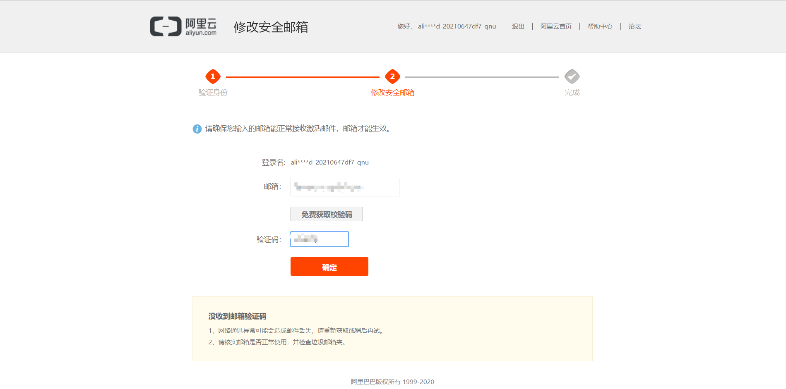

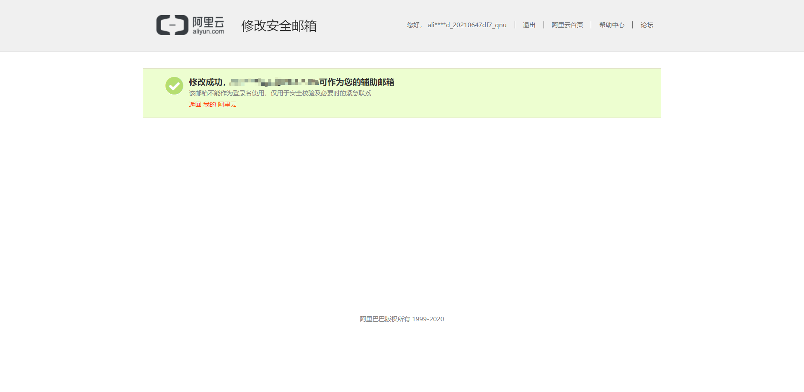

**3.开通应用高可用服务**

在阿里云中找到“产品分类”中的"开发与运维"中的”应用高可用服务AHAS“选项

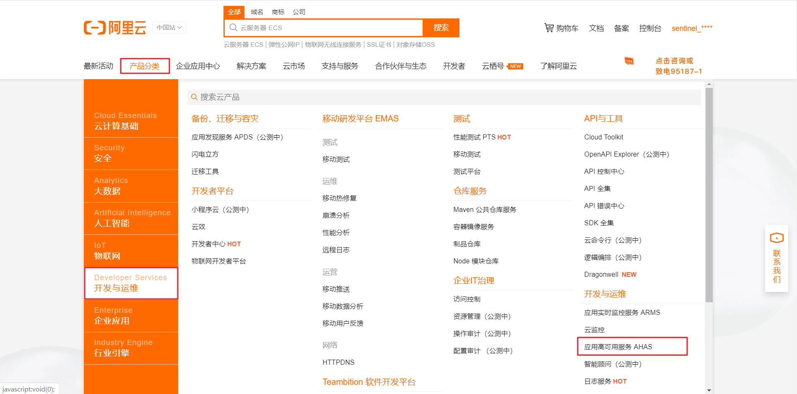

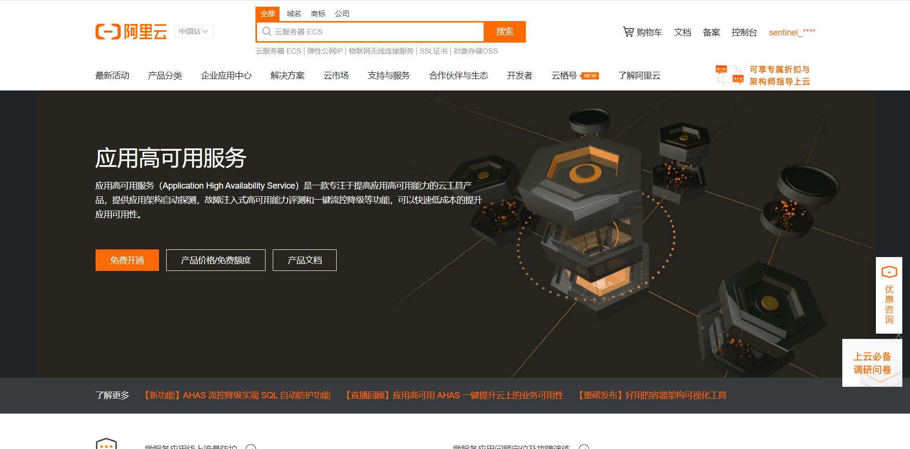

选择“免费开通”。

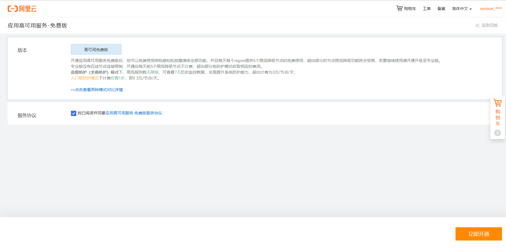

选择“立即开通”。开通成功之后，点击“管理控制台”，进入管理控制平台。

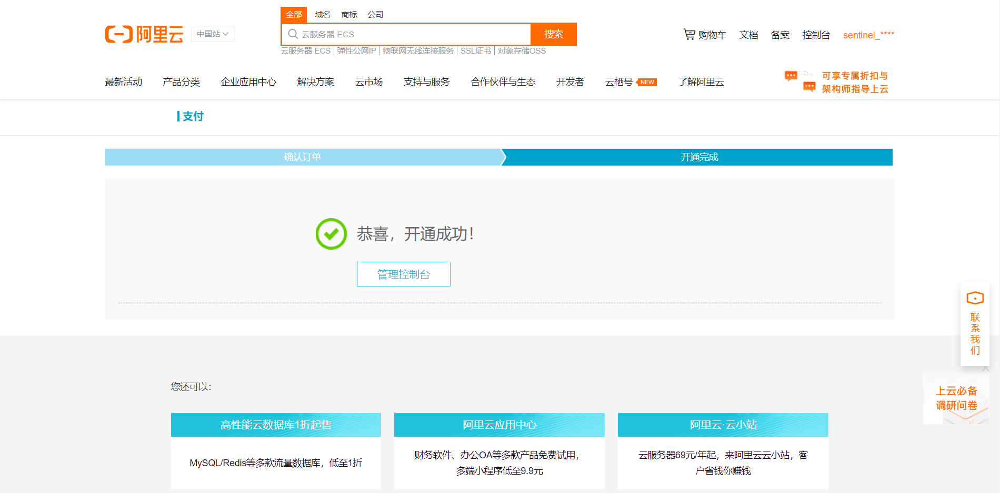


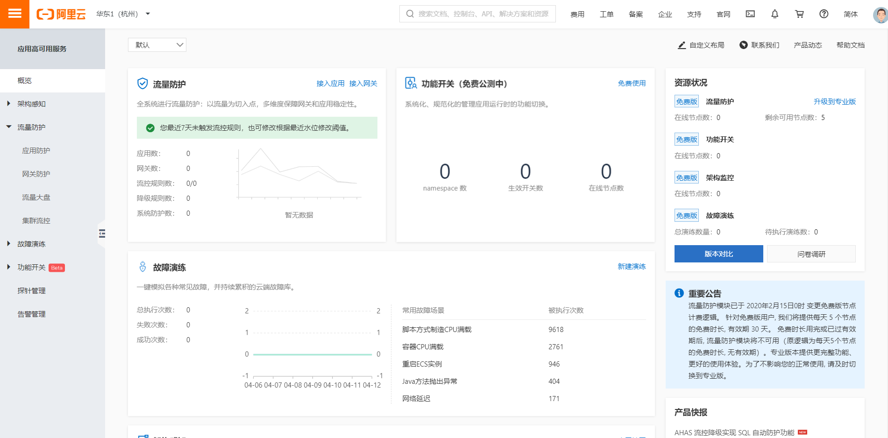

#### 3.1.2.公网Demo

公网Demo的操作主要分为三步，具体如下：

- 下载公网Demo
- 公网Demo接入阿里云AHAS控制台
- 定义公网Demo的流控规则

**1.公网Demo下载**

在控制台顶部的地域列表中，选择地域为**公网** 。

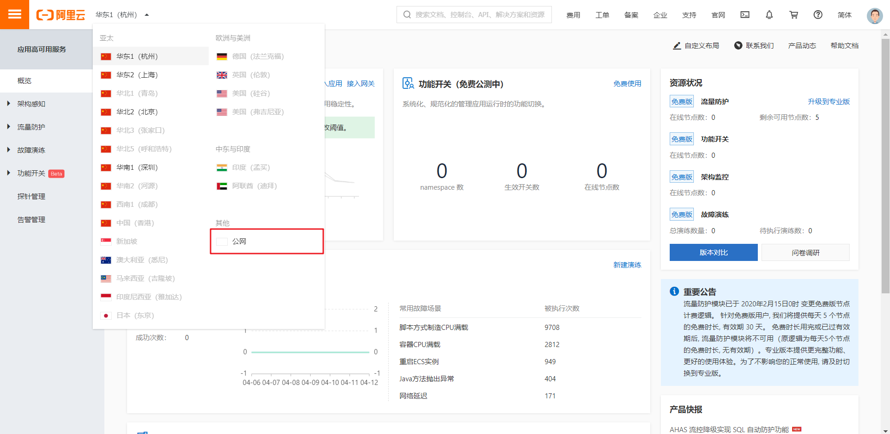

在控制台左侧导航栏选择“流量防护”中的“应用防护”，会弹出应用列表。

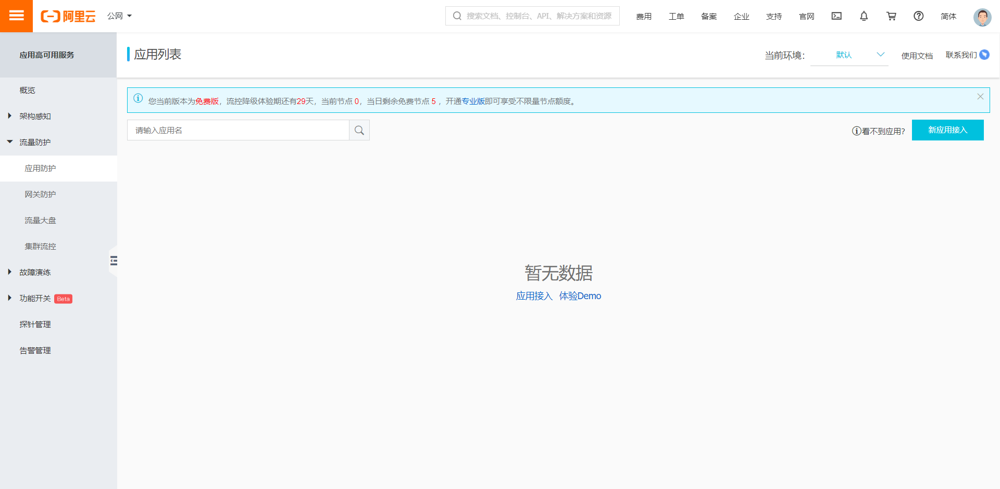

点击右侧的“新应用接入”按钮，弹出接入新应用的界面，选择接入语言“Java“，选择接入方式”体验Demo“。

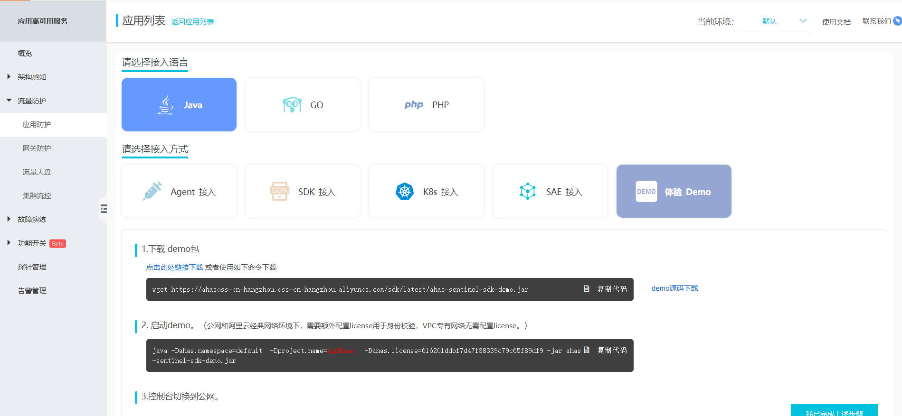

可以根据下面提供的下载Demo包的指令下载公网Demo，通过启动Demo的指令启动公网Demo，之后点击“我已完成上述步骤”按钮，完成公网Demo的接入操作。

公网Demo下载地址：https://ahasoss-cn-hangzhou.oss-cn-hangzhou.aliyuncs.com/sdk/latest/ahas-sentinel-sdk-demo.jar

如果没有网络，也可以到课程资料的“资料”目录下的“公网Demo”目录下找到提前准备好的ahas-sentinel-sdk-demo.jar来进行使用。

**2.公网Demo接入阿里云AHAS控制台**

执行以下指令启动公网Demo

```shell
java -Dahas.namespace=default  -Dproject.name=SentinelDemo  -Dahas.license=f7a69fd45e9d4135884ea1a6554faaa6 -jar ahas-sentinel-sdk-demo.jar
```

通过阿里云AHAS管理控制平台可以看到如下效果：

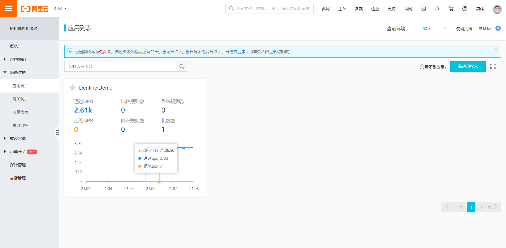

**3.定义流控规则**

在应用列表页面单击流控降级 SentinelDemo 的应用卡片，进入应用概览页面。

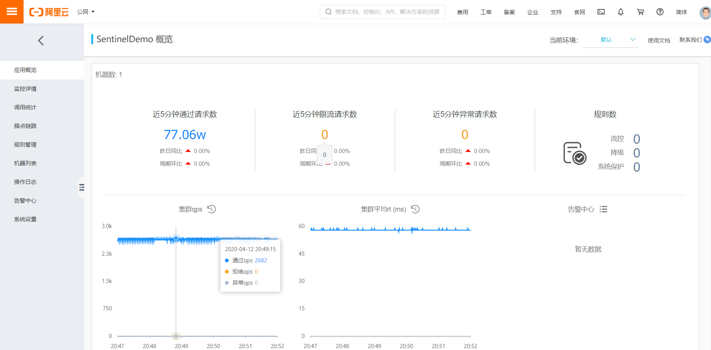

在控制台左侧导航栏中单击“监控详情”。在该应用的监控详情页面，单击 function_0 资源卡片右上角的“+”

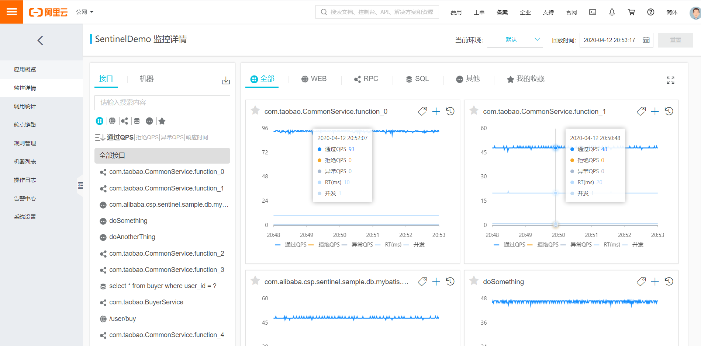

在新增规则对话框中，设置单机QPS阈值为 10，然后单击新建。


这样流控规则就设置好了，这是在查看function_0的标签，会有以下效果：

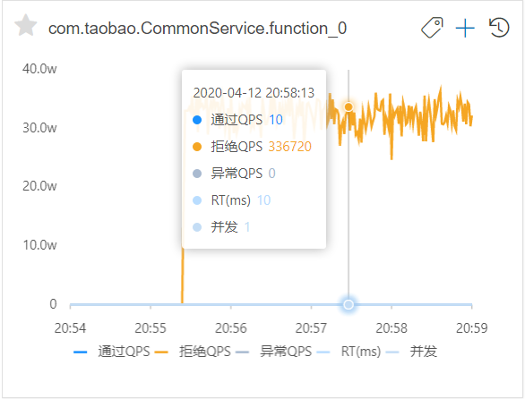

返回应用列表页面，查看SentinelDemo应用的情况，会发现多了一个流量控制规则，并且规则生效了

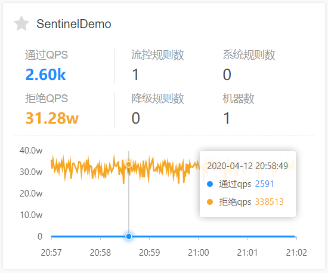

### 3.2.Sentinel流控降级入门

Sentinel本地应用流控降级实现分为三步：

1. 创建本地应用
2. 搭建本地Sentinel控制台
3. 本地应用接入本地Sentinel控制台

#### 3.2.1.本地应用创建

**整体流程分析**

1. 创建springboot项目
2. 在项目的pom.xml文件中引入sentinel-core的依赖坐标
3. 创建TestController，定义使用限流规则
4. 运行测试

**具体流程**

**1.创建springboot项目，名称为sentinel_quick_start**

**2.在项目的pom.xml文件中引入sentinel-core的依赖坐标**

```xml
<?xml version="1.0" encoding="UTF-8"?>
<project xmlns="http://maven.apache.org/POM/4.0.0" xmlns:xsi="http://www.w3.org/2001/XMLSchema-instance"
         xsi:schemaLocation="http://maven.apache.org/POM/4.0.0 https://maven.apache.org/xsd/maven-4.0.0.xsd">
    <modelVersion>4.0.0</modelVersion>
    <parent>
        <groupId>org.springframework.boot</groupId>
        <artifactId>spring-boot-starter-parent</artifactId>
        <version>2.1.4.RELEASE</version>
        <relativePath/> <!-- lookup parent from repository -->
    </parent>
    <groupId>com.itheima.sentinel</groupId>
    <artifactId>sentinel_quick_start</artifactId>
    <version>0.0.1-SNAPSHOT</version>
    <name>sentinel_quick_start</name>
    <description>Demo project for Spring Boot</description>

    <properties>
        <java.version>1.8</java.version>
    </properties>

    <dependencies>
        <dependency>
            <groupId>org.springframework.boot</groupId>
            <artifactId>spring-boot-starter-web</artifactId>
        </dependency>

        <!--sentinel核心依赖-->
        <dependency>
            <groupId>com.alibaba.csp</groupId>
            <artifactId>sentinel-core</artifactId>
            <version>1.7.2</version>
        </dependency>

    </dependencies>

    <build>
        <plugins>
            <plugin>
                <groupId>org.springframework.boot</groupId>
                <artifactId>spring-boot-maven-plugin</artifactId>
            </plugin>
        </plugins>
    </build>

</project>
```

单元测试我们不需要，所以将单元测试的依赖坐标和单元测试类删除。

**3.创建TestController，定义使用限流规则**

这里我们定义OPS类型的限流规则，每秒可接受的请求最多为2个，超过则返回给页面“系统繁忙，请稍候”，不超过则返回给页面“Hello Sentinel!”。

```java
@RestController
public class TestController {

    @GetMapping("hello")
    public String hello(){

        //1.进行限流控制
        try (Entry entry = SphU.entry("Hello")){//限流入口
            return "Hello Sentinel!";//被保护的资源
        } catch (BlockException e) {
            e.printStackTrace();
            return "系统繁忙，请稍候";//被限流或者降级的处理
        }

    }

    /**
     * 定义限流规则
     * @PostConstruct ：在构造函数执行完毕后执行
     */
    @PostConstruct
    public void initFlowRules(){
        //1.创建存放限流规则的集合
        List<FlowRule> rules = new ArrayList<FlowRule>();

        //2.创建限流规则
        FlowRule rule = new FlowRule();
        //定义资源
        rule.setResource("Hello");
        //定义限流规则类型,RuleConstant.FLOW_GRADE_QPS：OPS类型
        rule.setGrade(RuleConstant.FLOW_GRADE_QPS);
        //定义OPS每秒最多只能通过的请求个数
        rule.setCount(2);
        //将限流规则添加到集合中
        rules.add(rule);

        //3.加载限流规则
        FlowRuleManager.loadRules(rules);
    }

}
```

**4.运行测试**

通过浏览器访问http://localhost:8080/hello，慢速刷新，则持续显示”Hello Sentinel”；快速刷新则会交替出现”Hello Sentinel”和“系统繁忙，请稍候”。这说明对“Hello"资源限流成功。我们还可以通过查看日志获取限流详情，日志文件的位置可以在控制台找到(图中红框处)。

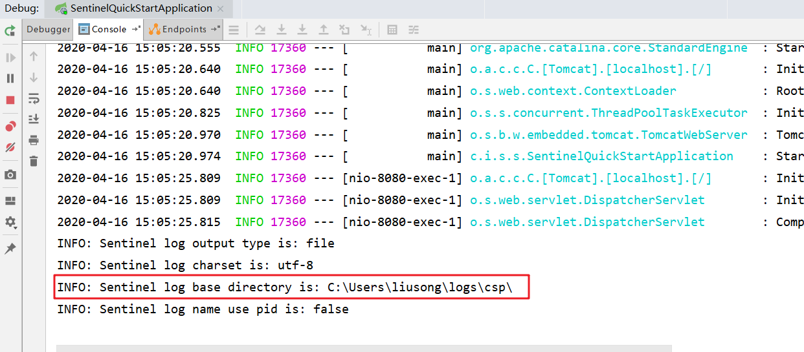

在该目录下找到com-itheima-sentinel-sentinel_quick_start-SentinelQuickStartApplication-metrics.log.yyyy-MM-dd文件，查看该文件内容如下所示：

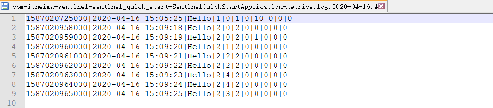

#### 3.2.2.本地Sentinel控制台搭建

Sentinel 提供一个轻量级的开源控制台，它提供机器发现以及健康情况管理、实时监控（单机和集群），规则管理和推送的功能。

**本地控制台搭建步骤**

**1.下载Sentinel控制台jar包**

下载地址：https://github.com/alibaba/Sentinel/releases/download/1.7.2/sentinel-dashboard-1.7.2.jar

**2.启动Sentinel控制台**

启动 Sentinel 控制台需要 JDK 版本为 1.8 及以上版本。

使用如下命令启动控制台：

```shell
java -Dserver.port=9000 -jar sentinel-dashboard-1.7.2.jar
```

**3.访问Sentinel控制台**

通过浏览器打开http://localhost:9000/即可访问Sentinel控制台，默认用户名和密码都是sentinel

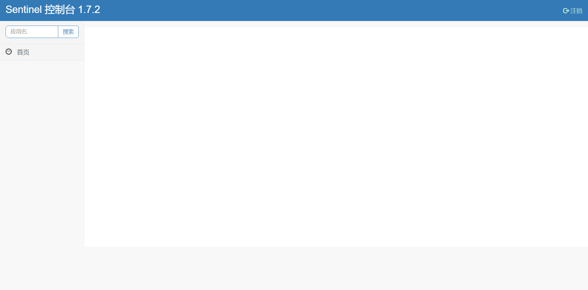

但是此时本地应用还没有接入到Sentinel控制台进行管理，所以接下来就要将本地应用接入到Sentinel控制台。

#### 3.2.3.应用接入控制台

本地应用是以客户端的身份来接入控制台，具体步骤如下：

**1.在本地应用的pom.xml文件中引入依赖**

```xml
<!--本地应用接入本地控制台的依赖-->
<dependency>
      <groupId>com.alibaba.csp</groupId>
      <artifactId>sentinel-transport-simple-http</artifactId>
      <version>1.7.2</version>
</dependency>
```

**2.在本地应用的JVM启动参数**

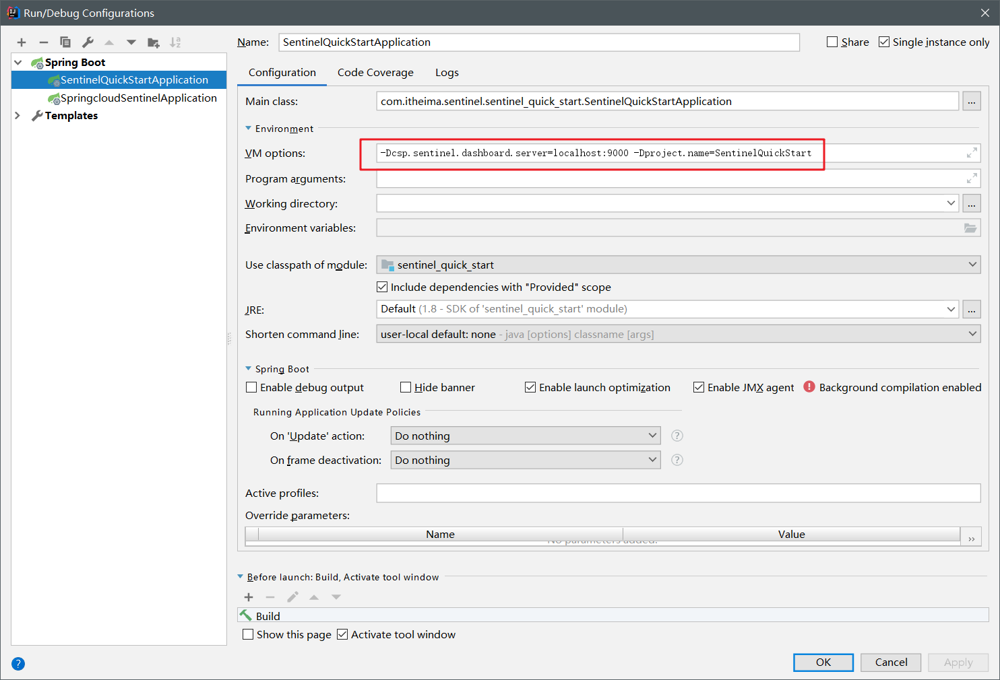

**-Dcsp.sentinel.dashboard.server=localhost:9000** ：设置Sentinel控制台的主机地址和端口

**-Dproject.name=SentinelQuickStart** ：设置本地应用在Sentinel控制台中的名称

**3.运行测试**

重启本地应用并重新通过浏览器访问http://localhost:8080/hello，快慢速刷新几次，查看控制台中的实时监控情况。

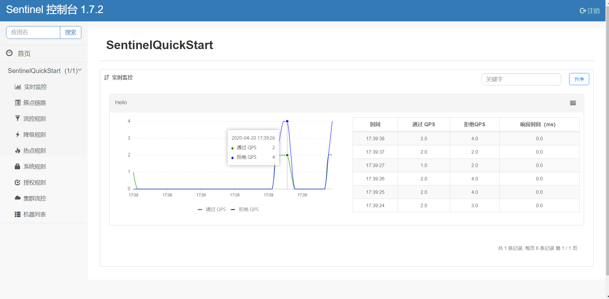

需要注意的是应用配置好了与控制台的连接参数之后，并不会主动连接上控制台，需要触发一次应用的规则才会开始进行初始化，并向控制台发送心跳和应用规则等信息。

此外还需要注意的是，Sentinel提供了两种设置流控规则的方式

- 在应用中使用代码编写流控规则（案例中使用的方式）

- 在Sentinel控制台设置流控规则

  在Sentinel控台的左侧菜单中选择流控规则即可对限流规则进行调整

  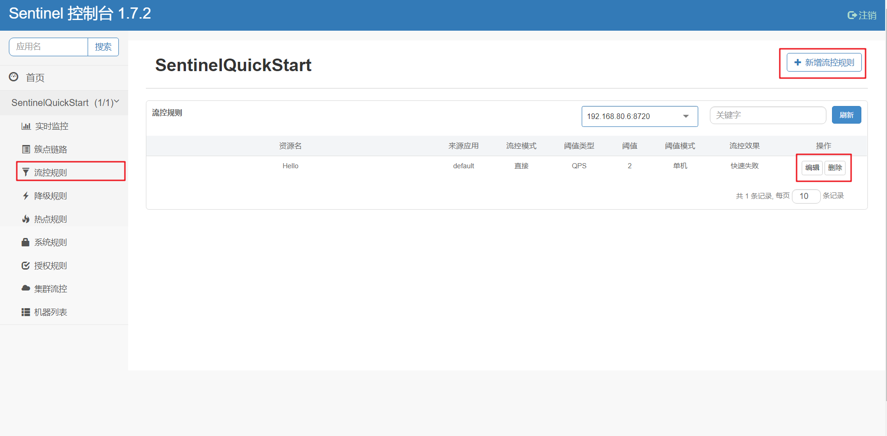

### 3.3.Sentinel定义资源的方式

Sentinel除了基本的定义资源的方式之外，还有其他的定义资源的方式，具体如下：

- 抛出异常的方式定义资源
- 返回布尔值方式定义资源
- 异步调用支持
- 注解方式定义资源
- 主流框架的默认适配

#### 3.3.1.抛出异常的方式定义资源

Sentinel中的SphU 包含了 try-catch 风格的 API。用这种方式，当资源发生了限流之后会抛出 BlockException。这个时候可以捕捉异常，进行限流之后的逻辑处理，而我们在入门案例中就使用的此种方式进行定义资源，关键代码如下：

```java
try (Entry entry = SphU.entry("Hello")){//使用限流规则监控保护资源
    return "Hello Sentinel!";//被保护的资源
} catch (BlockException e) {
     e.printStackTrace();
     return "系统繁忙，请稍候";//被限流或者降级的处理
}
```

#### 3.3.2.返回布尔值方式定义资源

Sentinel中的SphO 提供 if-else 风格的 API。用这种方式，当资源发生了限流之后会返回 `false`，这个时候可以根据返回值，进行限流之后的逻辑处理。

1.在sentinel_quick_start项目中创建TestBooleanController，在TestBooleanController中使用返回布尔值的方式定义资源

```java
@RestController
public class TestBooleanController {

    @GetMapping("boolean")
    public boolean hello() {

        //1..进行限流控制
        if (SphO.entry("Sentinel_Boolean")) {//限流入口
            try {
                //被保护的资源
                System.out.println("访问成功");
                return true;
            } finally {
                //SphO.entry(xxx)需要与 SphO.exit()方法成对出现，否则会导致调用链记录异常，抛出ErrorEntryFreeException异常
                SphO.exit();//限流出口，
            }
        } else {
            //被限流或者降级的处理
            System.out.println("系统繁忙，请稍候");
            return false;
        }

    }
}
```

**注意：**

SphO.entry(xxx)需要与 SphO.exit()方法成对出现，否则会导致调用链记录异常，抛出ErrorEntryFreeException异常。

2.运行测试

在Sentinel控制的中增加关于“Sentinel_Boolean”资源的流控规则

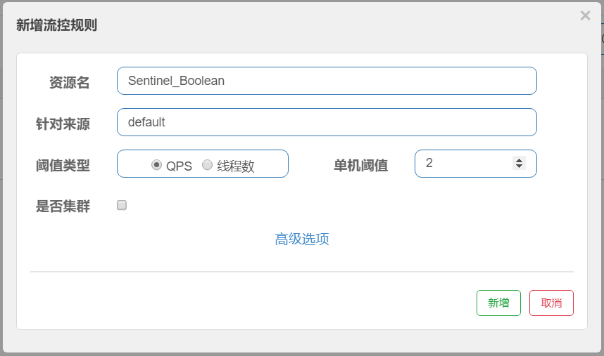

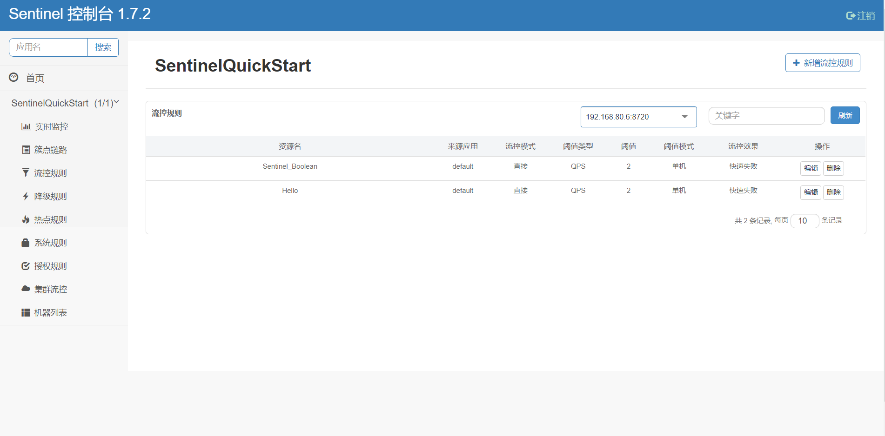

通过浏览器访问http://localhost:8080/boolean，慢速刷新，则持续显示”true”；而Idea打印台显示“访问成功”，快速刷新则会交替出现“true”和“false”，打印台则会交替出现“访问成功”和“系统繁忙，请稍候”，这说明使用返回布尔值方式对“Sentinel_Boolean"资源限流成功。

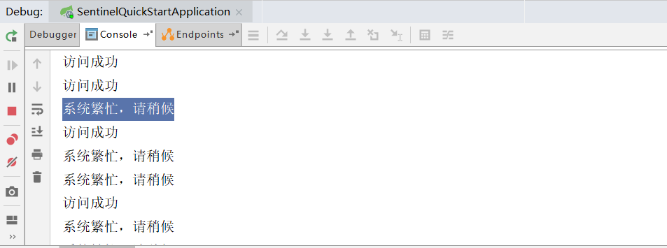

#### 3.3.3.异步调用支持

Sentinel 支持异步调用链路的统计。在异步调用中，需要通过 SphU.asyncEntry(xxx) 方法定义资源，并通常需要在异步的回调函数中调用 exit 方法。

1.在本地应用的引导类中添加@EnableAsync，表示springboot项目开始异步调用支持

```java
@SpringBootApplication
@EnableAsync
public class SentinelQuickStartApplication {

    public static void main(String[] args) {
        SpringApplication.run(SentinelQuickStartApplication.class, args);
    }

}
```

2.创建AsyncService编写异步调用的方法

```java
@Service
public class AsyncService {

	//@Async表示方法为异步调用方法
    @Async
    public void hello(){
        System.out.println("异步开始-----");
        try {
            Thread.sleep(5000);
        } catch (InterruptedException e) {
            e.printStackTrace();
        }
        System.out.println("完成异步----");
    }

}
```

3.创建TestAsyncController，实现异步调用限流控制

```java
@RestController
public class TestAsyncController {

    @Autowired
    private AsyncService asyncService;

    @GetMapping("async")
    public void hello() {

        //1.进行限流控制
        AsyncEntry asyncEntry = null;
        try {
            asyncEntry = SphU.asyncEntry("Sentinel_Async");//限流入口
            asyncService.hello();//异步方法调用
        } catch (BlockException e) {//被限流或者降级的处理
            System.out.println("系统繁忙，请稍候");
        }finally {
            if (asyncEntry != null){
                asyncEntry.exit();//限流出口，
            }
        }
    }

}
```

4.运行测试

在Sentinel控制的中增加关于“Sentinel_Async”资源的流控规则

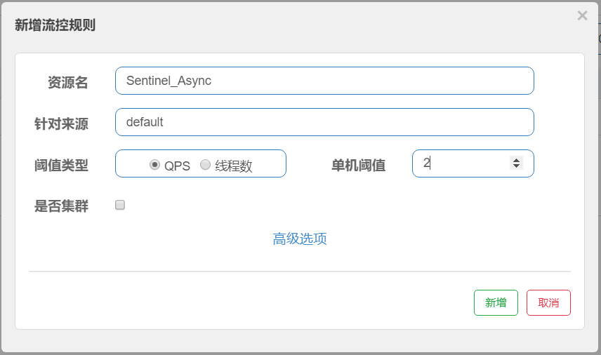

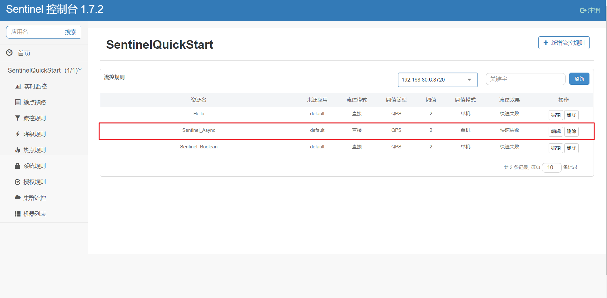

通过浏览器输入http://localhost:8080/async，慢速刷新，查看Idea的打印台，会发现打印台会打印出“异步开始-”；快速刷新可以查看Idea的打印台，则会发现打印台会交替打印出“异步开始”和“系统繁忙，请稍候”，这也说明对“Sentinel_Boolean"资源限流成功。

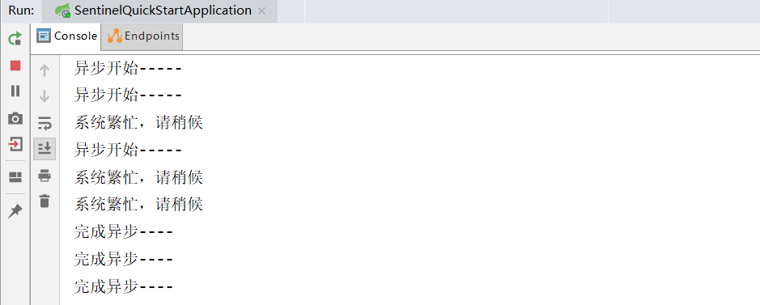

#### 3.3.4.注解方式定义资源

Sentinel 支持通过 @SentinelResource 注解定义资源并配置 blockHandler函数来进行限流之后的处理。

1.在本地应用的pom.xml文件中引入依赖

因为Sentinel中使用AspectJ 的扩展用于自动定义资源、处理 BlockException 等，所以需要在项目中引入sentinel-annotation-aspectj依赖。

```xml
<dependency>
    <groupId>com.alibaba.csp</groupId>
    <artifactId>sentinel-annotation-aspectj</artifactId>
    <version>1.7.2</version>
</dependency>
```

2.创建AspectJ 的配置类

```java
@Configuration
public class SentinelAspectConfiguration {

    @Bean
    public SentinelResourceAspect sentinelResourceAspect() {
        return new SentinelResourceAspect();
    }
}
```

3.创建TestAnnController，实现限流控制

```java
@RestController
public class TestAnnController {

    //定义限流资源和限流讲解回调函数
    @SentinelResource(value = "Sentinel_Ann", blockHandler = "exceptionHandler")
    @GetMapping("ann")
    public String hello() {
        return "Hello Sentinel!";
    }

    // blockHandler函数，原方法调用被限流/降级/系统保护的时候调用
    public String exceptionHandler(BlockException ex) {
        ex.printStackTrace();
        return "系统繁忙，请稍候";
    }

}
```

- @SentinelResource 注解用来标识资源是否被限流、降级。上述例子中该注解的属性 'Sentinel_Ann' 表示资源名。
- @SentinelResource 还提供了其它额外的属性如 blockHandler来指定被限流后的操作。

4.运行测试

在Sentinel控制的中增加关于“Sentinel_Ann”资源的流控规则

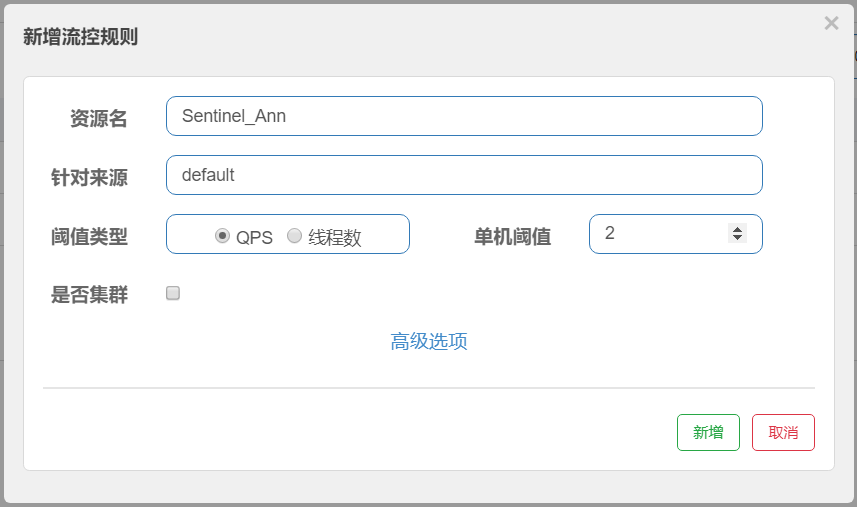

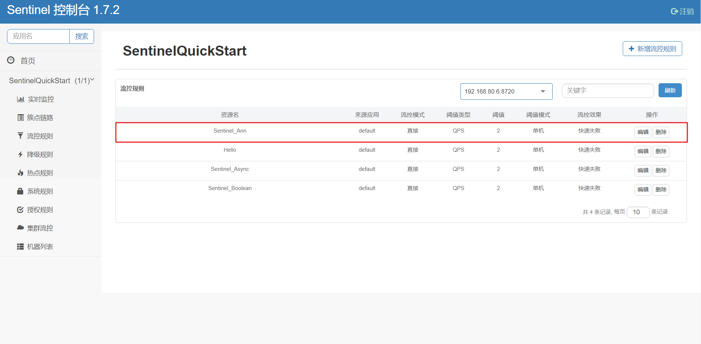

通过浏览器输入http://localhost:8080/ann，慢速刷新，则持续显示”Hello Sentinel”；快速刷新则会交替出现”Hello Sentinel”和“系统繁忙，请稍候”。这说明对“Sentinel_Ann"资源限流成功。

#### 3.3.5.主流框架的默认适配

为了减少开发的复杂程度，我们对大部分的主流框架，例如 Web Servlet、Dubbo、Spring Cloud、gRPC、Spring WebFlux、Reactor 等都做了适配。您只需要引入对应的依赖即可方便地整合 Sentinel。

## 4.Sentinel高级

### 4.1.Sentinel和SpringCloud整合

为了减少开发的复杂程度，我们对大部分的主流框架，例如 Web Servlet、Dubbo、Spring Cloud、gRPC、Spring WebFlux、Reactor 等都做了适配。您只需要引入对应的依赖即可方便地整合 Sentinel。

如果要实现SpringCloud和Sentinel的整合，可以通过引入 Spring Cloud Alibaba Sentinel 来更方便地整合 Sentinel。

Spring Cloud Alibaba是阿里巴巴提供的，致力于提供微服务开发的一站式解决方案。Spring Cloud Alibaba 默认为 Sentinel 整合了 Servlet、RestTemplate、FeignClient 和 Spring WebFlux。Sentinel 在 Spring Cloud 生态中，不仅补全了 Hystrix 在 Servlet 和 RestTemplate 这一块的空白，而且还完全兼容了 Hystrix 在 FeignClient 中限流降级的用法，并且支持运行时灵活地配置和调整限流降级规则。

**案例**

**需求**

使用SpringCloud+Sentinel实现访问http://localhost:8080/ann路径的流量控制。

**具体步骤**

1.创建springboot项目，在项目中引入spring-cloud-starter-alibaba-sentinel依赖

```xml
<dependency>
    <groupId>com.alibaba.cloud</groupId>
    <artifactId>spring-cloud-starter-alibaba-sentinel</artifactId>
    <version>2.1.0.RELEASE</version>
</dependency>
```

2.在项目中创建TestController

```java
@RestController
public class TestController {

    //定义限流资源和限流讲解回调函数
    @SentinelResource(value = "Sentinel_SpringCloud", blockHandler = "exceptionHandler")
    @GetMapping("ann")
    public String hello() {
        return "Hello Sentinel!";
    }

    // blockHandler函数，原方法调用被限流/降级/系统保护的时候调用
    public String exceptionHandler(BlockException ex) {
        ex.printStackTrace();
        return "系统繁忙，请稍候";
    }
}
```

3.在application.properties中配置本地项目接入本地控制台

```properties
# 设置应用的名称
spring.application.name=SpringCloudSentinel
# 设置Sentinel连接控制台的主机地址和端口
spring.cloud.sentinel.transport.dashboard=localhost:9000
```

4.运行测试

在Sentinel控制的中增加关于“Sentinel_SpringCloud”资源的流控规则

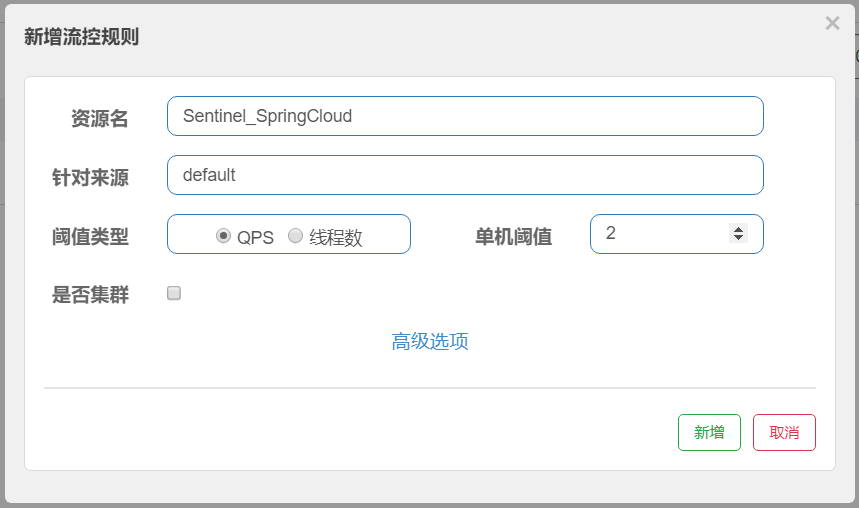

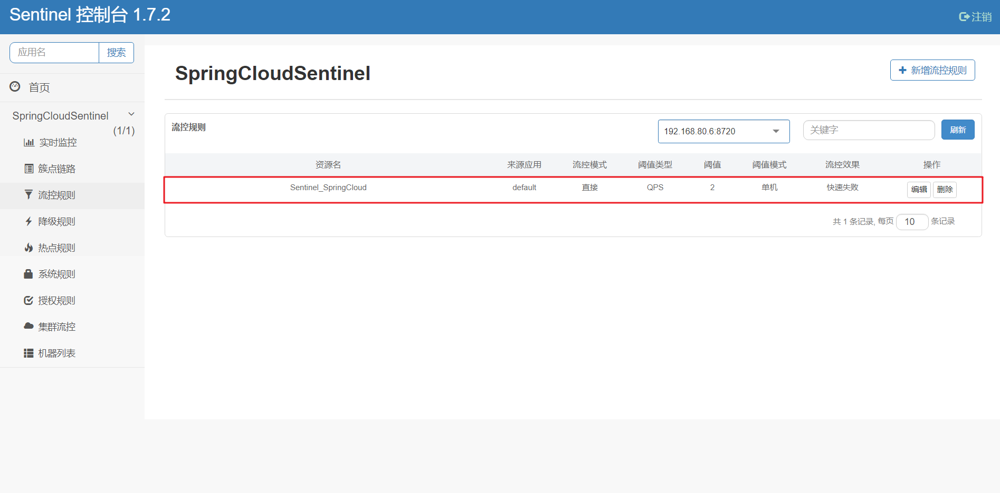

启动本地应用并重新通过浏览器访问http://localhost:8080/ann，快慢速刷新几次，查看控制台中的实时监控情况。

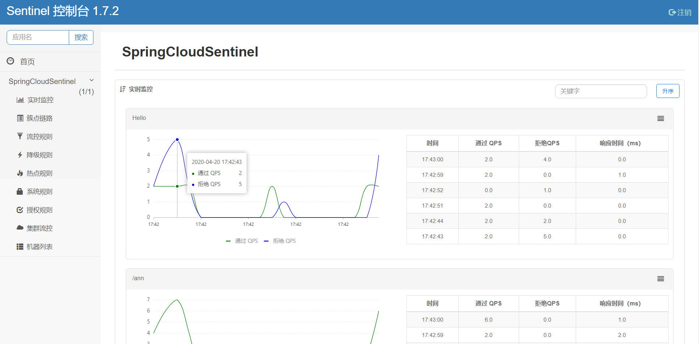

### 4.2.Sentinel对Feign的支持

Sentinel 适配了 Feign组件。如果想使用，除了引入 `spring-cloud-starter-alibaba-sentinel` 的依赖外还需要 2 个步骤：

- 配置文件打开 Sentinel 对 Feign 的支持：`feign.sentinel.enabled=true`
- 加入 `spring-cloud-starter-openfeign` 依赖使 Sentinel starter 中的自动化配置类生效;

**案例**

**需求**

实现sentinel_feign_client微服务通过Feign访问sentinel_feign_provider微服务的流量控制

**创建sentinel_parent、eureka_server、sentinel_feign_provider、sentinel_feign_client工程，并在sentinel_feign_client中使用feign访问sentinel_feign_provider服务。**

1.创建父工程sentinel_parent，在父工程的pom.xml文件中对SpringCloud依赖的进行管理

```xml
<dependencyManagement>
        <dependencies>
            <dependency>
                <groupId>org.springframework.cloud</groupId>
                <artifactId>spring-cloud-dependencies</artifactId>
                <version>Greenwich.RELEASE</version>
                <type>pom</type>
                <scope>import</scope>
            </dependency>
        </dependencies>
</dependencyManagement>
```

2.创建子工程eureka_server工程，作为注册中心

2.1.在pom.xml文件中引入依赖

```xml
<dependencies>
    <!--eureka服务端依赖-->
    <dependency>
        <groupId>org.springframework.cloud</groupId>
        <artifactId>spring-cloud-starter-netflix-eureka-server</artifactId>
    </dependency>
</dependencies>
```

2.2.引导类中添加Eureka的服务注解

```java
//声明当前应用是Eureka注册中心服务
@EnableEurekaServer
@SpringBootApplication
public class Application {
    public static void main(String[] args) {
        SpringApplication.run(Application.class, args);
    }
}
```

2.3.配置文件配置eureka

```yaml
#设置服务端口
server:
  port: 9010

#设置eureka服务的名称
spring:
  application:
    name: eureka-server

#eureka配置
eureka:
  client:
    service-url:
      # eureka 服务地址，如果是集群的话；需要指定其它集群eureka地址
      defaultZone: http://127.0.0.1:9010/eureka
    # 不注册自己
    register-with-eureka: false
    # 不拉取服务
    fetch-registry: false
```

2.4.运行测试

启动项目，通过浏览器访问http://127.0.0.1:9010/，如果能看到如下界面就说明eureka注册中心已经配置成功

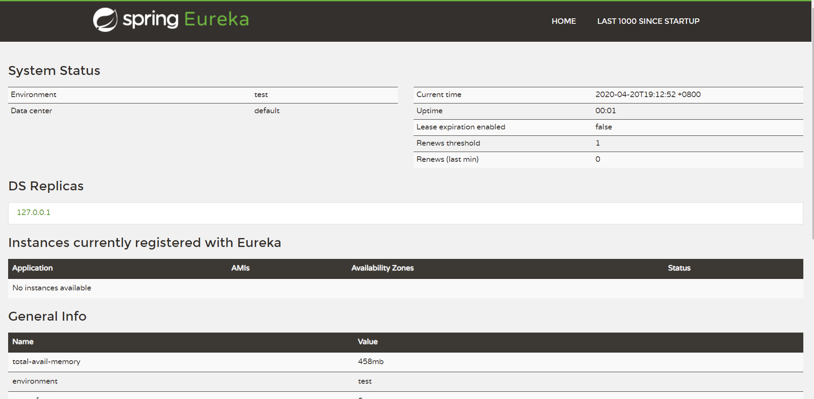

3.创建子工程sentinel_feign_provider，作为服务的提供方

3.1.在pom.xml文件中引入依赖

```xml
<dependencies>
  <dependency>
     <groupId>org.springframework.boot</groupId>
     <artifactId>spring-boot-starter-web</artifactId>
   </dependency>

   <!--eureka客户端依赖-->
   <dependency>
       <groupId>org.springframework.cloud</groupId>
       <artifactId>spring-cloud-starter-netflix-eureka-client</artifactId>
   </dependency>
</dependencies>
```

3.2.引导类中添加Eureka客户端注解

```java
@EnableDiscoveryClient //开启Eureka客户端发现功能
@SpringBootApplication
public class Application {
    public static void main(String[] args) {
        SpringApplication.run(Application.class, args);
    }
}
```

3.3.在application.yml文件中进行配置

```yaml
#tomcat端口
server:
  port: 9011

#应用的名称
spring:
  application:
    name: sentinel_feign_provider

#eureka的配置
eureka:
  client:
    service-url:
      defaultZone: http://127.0.0.1:9010/eureka  #要注册到的注册中心的地址
```

3.4.创建controller，方便sentinel_feign_client进行调用

```java
@RestController
public class ProviderController {

    @GetMapping("hello")
    public String hello(){
        return "Hello Sentinel!";
    }
}
```

3.5.运行测试

启动项目，查看项目是否注册到eureka注册中心中

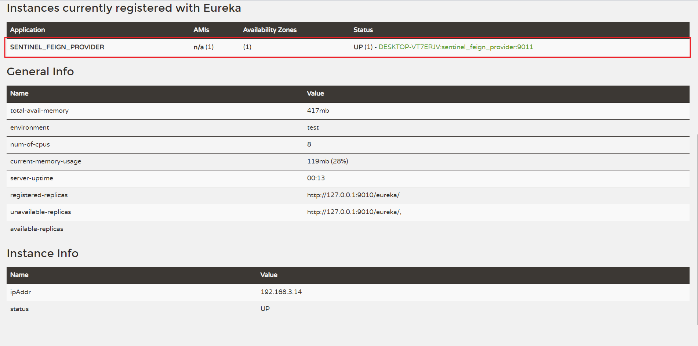

浏览器输入http://localhost:9011/hello，查看是否能访问成功。

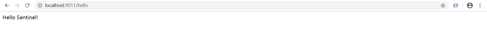

4.创建子工程sentinel_feign_client

4.1.在pom.xml文件中引入依赖

项目中要使用Fegin来进行访问sentinel_fegin_provider微服务，所以需要额外引入spring-cloud-starter-openfeign依赖，整合sentinel还需要引入spring-cloud-starter-alibaba-sentinel依赖。

```xml
<dependencies>
        <dependency>
            <groupId>org.springframework.boot</groupId>
            <artifactId>spring-boot-starter-web</artifactId>
        </dependency>

        <!--eureka客户端依赖-->
        <dependency>
            <groupId>org.springframework.cloud</groupId>
            <artifactId>spring-cloud-starter-netflix-eureka-client</artifactId>
        </dependency>
    
   		<!--feign的起步依赖-->
        <dependency>
            <groupId>org.springframework.cloud</groupId>
            <artifactId>spring-cloud-starter-openfeign</artifactId>
        </dependency>
</dependencies>
```

4.2.引导类中添加Eureka客户端注解

```java
@EnableDiscoveryClient  //开启Eureka客户端发现功能
@SpringBootApplication
@EnableFeignClients //开启feign功能
public class Application {
    public static void main(String[] args) {
        SpringApplication.run(Application.class, args);
    }
}
```

4.3.在application.yml文件中进行配置

在application.yml文件中要专门开启 Sentinel 对 Feign 的支持。

```yaml
#tomcat端口
server:
  port: 9012

#应用的名称
spring:
  application:
    name: sentinel-feign-client
  cloud:
    sentinel:
      transport:
        dashboard: localhost:9000

#eureka的配置
eureka:
  client:
    service-url:
      defaultZone: http://127.0.0.1:9010/eureka  #要注册到的注册中心的地址
```

4.4.创建Feign代理接口

```java
@FeignClient(value="sentinel-feign-provider")
public interface FeignAgent {
    @GetMapping("/hello")
    String hello();
}
```

4.5.创建controller，使用Feign访问sentinel_feign_provider微服务。

```java
@RestController
public class TestController {

    @Autowired
    private FeignAgent feignAgent;

    @GetMapping("hello")
    public String hello(){
        return feignAgent.hello();
    }
}
```

4.6.运行测试

启动项目，查看项目是否注册到eureka注册中心中。

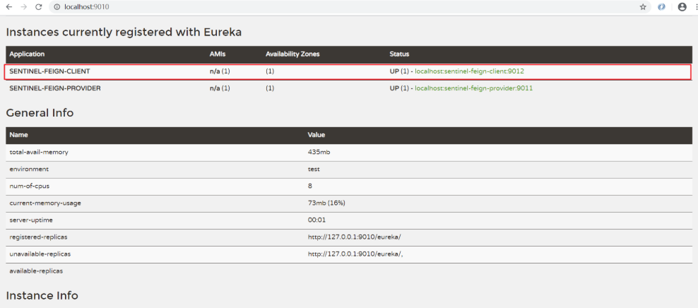

浏览器输入http://localhost:9012/hello，查看是否能访问成功。

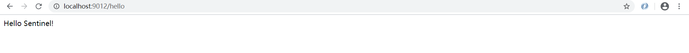

**整合sentinel**

1.在sentinel_feign_client工程的pom.xml中引入Spring Cloud Alibaba Sentinel依赖

```xml
<!--Spring Cloud Alibaba Sentinel依赖-->
<dependency>
    <groupId>com.alibaba.cloud</groupId>
    <artifactId>spring-cloud-starter-alibaba-sentinel</artifactId>
    <version>2.1.0.RELEASE</version>
</dependency>
```

2.在application.yml中开启Sentinel对Feign的支持

```yaml
# sentinel控制台的主机地址和端口
spring:
  cloud:
    sentinel:
      transport:
        dashboard: localhost:9000

# 开启 Sentinel 对 Feign 的支持
feign:
  sentinel:
    enabled: true
```

3.创建FallbackService，作为流控降级回调类，并在FeignAgent进行流控降级回调配置

```java
@Component
public class FallbackService implements FeignAgent {
    @Override
    public String hello() {
        return "系统繁忙，请稍后";
    }
}
```

```java
@FeignClient(value="sentinel-feign-provider",fallback = FallbackService.class)
public interface FeignAgent {
    @GetMapping("/hello")
    String hello();
}
```

4.运行测试

启动项目，在Sentinel控制中增加关于资源的流控规则，Sentinel和Feign整合时，流控规则的编写形式为：**http请求方式:协议://服务名/请求路径跟参数**，例如：**GET:http://sentinel-feign-provider/hello**。

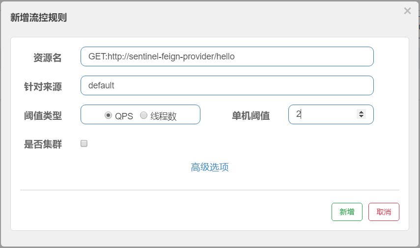

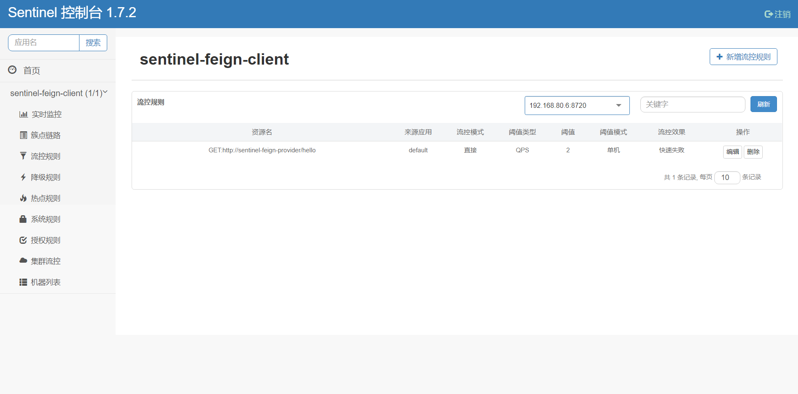

通过浏览器输入http://localhost:9012/hello，慢速刷新，则持续显示”Hello Sentinel”；快速刷新则会交替出现”Hello Sentinel”和“系统繁忙，请稍候”。这说明对资源限流成功。

### 4.3.Sentinel对Spring Cloud Gateway的支持

从 1.6.0 版本开始，Sentinel 提供了 Spring Cloud Gateway 的适配模块，可以提供两种资源维度的限流：

- route 维度：即在 Spring 配置文件中配置的路由条目，资源名为对应的 routeId
- 自定义 API 维度：用户可以利用 Sentinel 提供的 API 来自定义一些 API 分组

**网关微服务构建**

1.创建子工程sentinel_gateway，在pom.xml文件中引入依赖

```xml
<dependencies>
        <!--网关的起步依赖-->
        <dependency>
            <groupId>org.springframework.cloud</groupId>
            <artifactId>spring-cloud-starter-gateway</artifactId>
        </dependency>

        <!--eureka注册中心客户端的起步依赖-->
        <dependency>
            <groupId>org.springframework.cloud</groupId>
            <artifactId>spring-cloud-starter-netflix-eureka-client</artifactId>
        </dependency>
</dependencies>
```

2.在引导类中配置eureka客户端开启注解

```java
@SpringBootApplication
@EnableDiscoveryClient //开启Eureka客户端发现功能
public class GateWayApplication {
    public static void main(String[] args) {
        SpringApplication.run(GateWayApplication.class, args);
    }
}
```

3.在application.yml配置文件中配置应用的端口、应用的名称、eureka配置

```yaml
# 端口
server:
  port: 9013

# 应用的名称
spring:
  application:
    name: sentinel-gateway

# eureka配置
eureka:
  client:
    service-url:
      defaultZone: http://127.0.0.1:9010/eureka
```

4.在application.yml配置文件中进行网关配置

```yaml
spring:
  # 网关配置
  cloud:
    gateway:
      routes:
        - id: sentinel-feign-gateway
          # 路由转发路径
          uri: lb://sentinel-feign-client:9012
          # 断言
          predicates:
            - Path=/hello/**
```

5.运行测试

启动微服务

- eureka_server
- sentinel_feign_client
- sentinel_feign_provider
- sentinel_gateway

浏览器输入http://localhost:9013/hello，浏览器会显示出”Hello Sentinel!“的内容，表示网关微服务已经配置好。

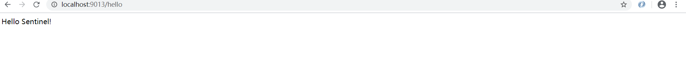

**整合sentinel**

网关微服务配置好之后，就可以开始整合Spring Cloud GateWay和Sentinel了。

1.在sentinel_gateway的pom.xml中引入依赖

```xml
<!--Spring Cloud Alibaba Sentinel依赖-->
<dependency>
    <groupId>com.alibaba.cloud</groupId>
    <artifactId>spring-cloud-starter-alibaba-sentinel</artifactId>
    <version>2.1.0.RELEASE</version>
</dependency>

<!--sentinel支持spring cloud gateway的依赖-->
<dependency>
     <groupId>com.alibaba.cloud</groupId>
     <artifactId>spring-cloud-alibaba-sentinel-gateway</artifactId>
     <version>2.1.0.RELEASE</version>
</dependency>
```

2.创建GatewayConfiguration配置类，配置流控降级回调操作

```java
@Component
public class GatewayConfiguration {

    @PostConstruct
    public void doInit() {
        //限流回调函数
        GatewayCallbackManager.setBlockHandler(new BlockRequestHandler() {
            //当请求被限流是调用的方法
            @Override
            public Mono<ServerResponse> handleRequest(ServerWebExchange serverWebExchange, Throwable throwable) {

                return ServerResponse.status(200).syncBody("系统繁忙，请稍候");
            }
        });
    }

}
```

3..在application.yml中配置Sentinel控制台访问地址

```yaml
spring:
  cloud:
    # sentinel控制台地址
    sentinel:
      transport:
        dashboard: localhost:9000
```

4.运行测试

启动项目，在Sentinel控制中增加关于资源的流控规则，Sentinel在适配Spring Cloud Gateway时提供了两种配置资料的规则

- route 维度：即在 Spring 配置文件中配置的路由条目，资源名为对应的 routeId
- 自定义 API 维度：用户可以利用 Sentinel 提供的 API 来自定义一些 API 分组

**route维度规则定义**

在sentinel控制台中增加流控规则，其中API类型选择“Route ID”，API名称为网关配置的路由id，QPS阀值设置为2。

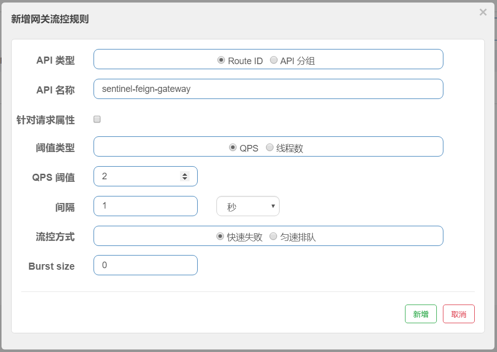


之后，在浏览器中输入http://localhost:9013/hello，慢速刷新，则持续显示”Hello Sentinel”；快速刷新则会交替出现”Hello Sentinel”和“系统繁忙，请稍候”。这说明对资源限流成功。

**自定义 API 维度**

在sentinel控制台的左侧菜单中选择“API管理”，在弹出的窗口中新增API分组，API名称自己定义，匹配模式选择”前缀“，匹配串设置为网关路由的断言路径。

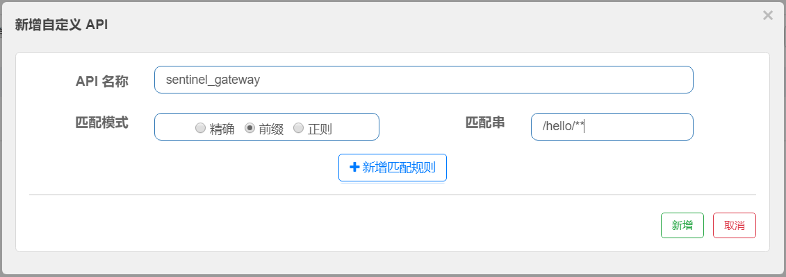

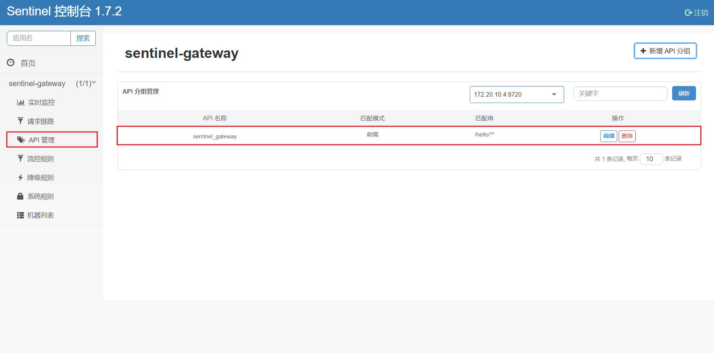

之后，在sentinel控制台的左侧菜单中选择“流控规则”，其中API类型选择“API分组”，API名称为之前添加的API分组的名称，QPS阀值设置为2。

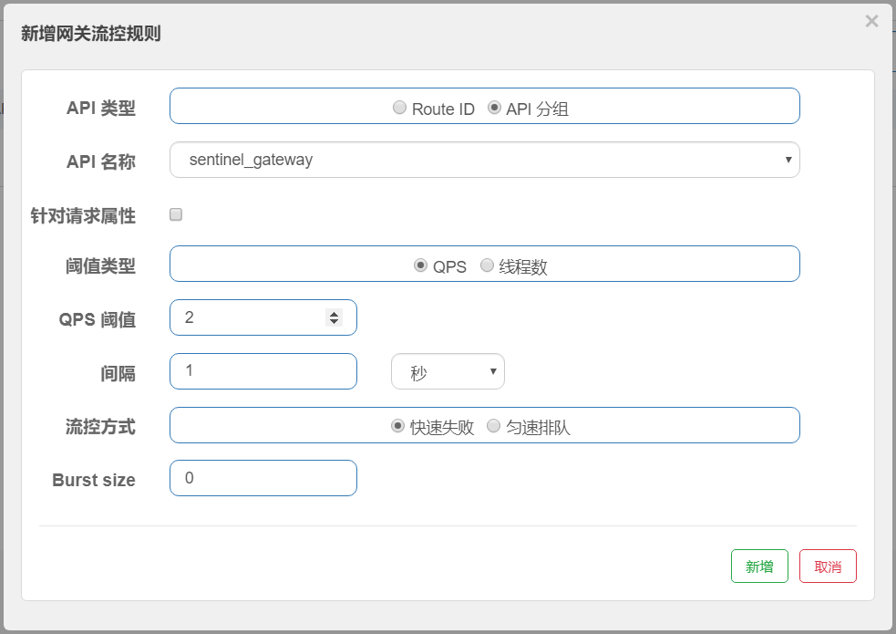

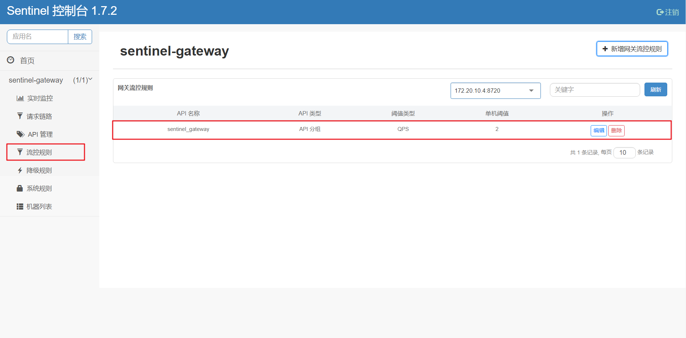

之后，在浏览器中输入http://localhost:9013/hello，慢速刷新，则持续显示”Hello Sentinel”；快速刷新则会交替出现”Hello Sentinel”和“系统繁忙，请稍候”。这说明对资源限流成功。

### 4.4.流量控制实现

Sentinel 的所有规则都可以在内存态中动态地查询及修改，修改之后立即生效。同时 Sentinel 也提供相关 API，供您来定制自己的规则策略。

Sentinel 主要支持以下几种规则：

- 流量控制规则
- 熔断降级规则
- 系统保护规则
- 来源访问控制规则 
- 动态规则扩展

**流量控制规则实现**

**流量控制**（flow control），其原理是监控应用流量的 QPS 或并发线程数等指标，当达到指定的阈值时对流量进行控制，以避免被瞬时的流量高峰冲垮，从而保障应用的高可用性。

**流量控制主要有两种方式**

- **并发线程数**：并发线程数限流用于保护业务线程数不被耗尽
- **QPS**：当 QPS 超过某个阈值的时候，则采取措施进行流量控制

一条限流规则主要由下面几个因素组成，我们可以组合这些元素来实现不同的限流效果：

- `resource`：资源名，即限流规则的作用对象
- `count`: 限流阈值
- `grade`: 限流阈值类型（QPS 或并发线程数）
- `limitApp`: 流控针对的调用来源，若为 `default` 则不区分调用来源
- `strategy`: 调用关系限流策略
- `controlBehavior`: 流量控制效果（直接拒绝、Warm Up、匀速排队）
  - **直接拒绝**（`RuleConstant.CONTROL_BEHAVIOR_DEFAULT`）方式是默认的流量控制方式，当QPS超过任意规则的阈值后，新的请求就会被立即拒绝，拒绝方式为抛出`FlowException`。这种方式适用于对系统处理能力确切已知的情况下，比如通过压测确定了系统的准确水位时。
  - **Warm Up**（`RuleConstant.CONTROL_BEHAVIOR_WARM_UP`）方式，即预热/冷启动方式。当系统长期处于低水位的情况下，当流量突然增加时，直接把系统拉升到高水位可能瞬间把系统压垮。通过"冷启动"，让通过的流量缓慢增加，在一定时间内逐渐增加到阈值上限，给冷系统一个预热的时间，避免冷系统被压垮。
  - **排队等待**（`RuleConstant.CONTROL_BEHAVIOR_RATE_LIMITER`）方式会严格控制请求通过的间隔时间，也即是让请求以均匀的速度通过，对应的是漏桶算法。

同一个资源可以同时有多个限流规则，检查规则时会依次检查。

### 4.5.熔断降级实现

**熔断降级**会在调用链路中某个资源出现不稳定状态时（例如调用超时或异常比例升高），对这个资源的调用进行限制，让请求快速失败，避免影响到其它的资源而导致级联错误。当资源被降级后，在接下来的降级时间窗口之内，对该资源的调用都自动熔断（默认行为是抛出 `DegradeException`）。

**重要的属性**

| Field               | 说明                                                         | 默认值      |
| ------------------- | ------------------------------------------------------------ | ----------- |
| resource            | 资源名，即限流规则的作用对象                                 |             |
| count               | 阈值                                                         |             |
| grade               | 熔断策略，支持秒级 RT/秒级异常比例/分钟级异常数              | 秒级平均 RT |
| timeWindow          | 降级的时间，单位为 s                                         |             |
| rtSlowRequestAmount | RT 模式下 1 秒内连续多少个请求的平均 RT 超出阈值方可触发熔断（1.7.0 引入） | 5           |
| minRequestAmount    | 异常熔断的触发最小请求数，请求数小于该值时即使异常比率超出阈值也不会熔断（1.7.0 引入） | 5           |

同一个资源可以同时有多个降级规则。

熔断策略详解：

- 平均响应时间 (DEGRADE_GRADE_RT)：当 1s 内持续进入 N 个请求，对应时刻的平均响应时间（秒级）均超过阈值（count，以 ms 为单位），那么在接下的时间（DegradeRule 中的 timeWindow，以 s 为单位）之内，对这个方法的调用都会自动地熔断（抛出 DegradeException）。
- 异常比例 (DEGRADE_GRADE_EXCEPTION_RATIO)：当资源的每秒请求量 >= N（可配置），并且每秒异常总数占通过量的比值超过阈值（DegradeRule 中的 count）之后，资源进入降级状态，即在接下的时间（DegradeRule 中的 timeWindow，以 s 为单位）之内，对这个方法的调用都会自动地返回。异常比率的阈值范围是 [0.0, 1.0]，代表 0% - 100%。
- 异常数 (DEGRADE_GRADE_EXCEPTION_COUNT)：当资源近 1 分钟的异常数目超过阈值之后会进行熔断。注意由于统计时间是分钟级别的，若 timeWindow小于 60s，则结束熔断状态后仍可能再进入熔断状态。

**这里演示如何使用平均响应时间(DEGRADE_GRADE_RT)配置规则**

**实现步骤**

熔断降级规则设置有两种方式

- 本地代码设置
- 在Sentinel控制台动态设置

**平均响应时间**

**本地代码设置**

1.导入资料中的sentinel_rule项目。

2.创建DegradeController，在其中编写修改以下代码

```java
@RestController
public class DegradeController {

    //定义限流资源和限流讲解回调函数
    @SentinelResource(value = "Sentinel_Rule",fallback = "exceptionHandler")
    @GetMapping("degrade")
    public String hello() {

        return "Hello Sentinel!";
    }

    // 降级方法
    public String exceptionHandler() {
        return "系统繁忙，请稍候";
    }
}
```

3.在DegradeController中编写以下代码

```java
@PostConstruct
private void initDegradeRule() {
        //1.创建存放熔断降级规则的集合
        List<DegradeRule> rules = new ArrayList<>();

        //2.创建熔断降级规则
        DegradeRule rule = new DegradeRule();
        //定义资源
        rule.setResource("Sentinel_Rule");
        //阈值
        rule.setCount(0.01);
        //定义规则类型,RuleConstant.DEGRADE_GRADE_RT：熔断降级(秒级 RT)类型
    	/**
         * 当资源的平均响应时间超过阈值（DegradeRule中的count，以ms为单位）之后，资源进入准降级状态。
         * 接下来如果持续进入 5 个请求，它们的 RT 都持续超过这个阈值，
         * 那么在接下的时间窗口（DegradeRule 中的 timeWindow，以 s 为单位）之内，
         * 将会抛出 DegradeException。
         */
        rule.setGrade(RuleConstant.DEGRADE_GRADE_RT);
        //降级的时间，单位为 s
        rule.setTimeWindow(10);
        //将熔断降级规则添加到集合中
        rules.add(rule);

        //3.加载熔断降级规则
        DegradeRuleManager.loadRules(rules);
}
```

运行测试

通过浏览器输入http://localhost:8080/ann，慢速刷新，则持续显示”Hello Sentinel”；快速刷新多次之后则会出现“系统繁忙，请稍候”，并且之后再次刷新都显示“系统繁忙，请稍候”，等待10秒之后，则再次显示“Hello Sentinel”，这说明对资源限流成功。

**在Sentinel控制台动态设置**

将DegradeController中的代码设置熔断降级规则删除，重启项目，在Sentinel控制台动态设置熔断降级规则。

在Sentinel控制台的左侧菜单中选择“降级规则”，点击“新增降级规则”按钮，设置熔断降级规则，其中降级策略设选择“RT”。

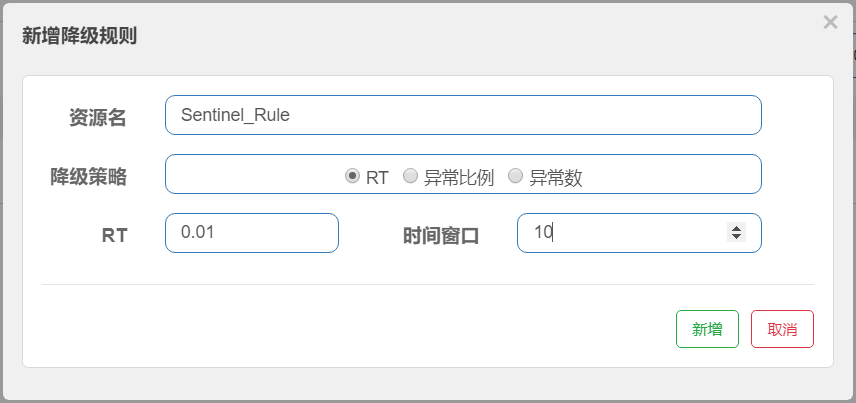

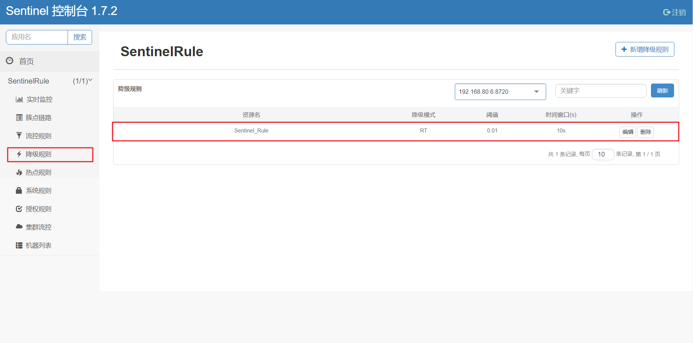

之后，通过浏览器输入http://localhost:8080/ann，慢速刷新，则持续显示”Hello Sentinel”；快速刷新多次之后则会出现“系统繁忙，请稍候”，并且之后再次刷新都显示“系统繁忙，请稍候”，等待10秒之后，则再次显示“Hello Sentinel”，这说明对资源限流成功。

### 4.6.系统自适应保护实现

Sentinel 系统自适应限流从整体维度对应用入口流量进行控制，结合应用的 Load、CPU 使用率、总体平均 RT、入口 QPS 和并发线程数等几个维度的监控指标，通过自适应的流控策略，让系统的入口流量和系统的负载达到一个平衡，让系统尽可能保持最大吞吐量的同时保证系统整体的稳定性。

系统保护规则是应用整体维度的，而不是资源维度的，并且**仅对入口流量生效**。入口流量指的是进入应用的流量（EntryType.IN），比如 Web 服务或 Dubbo 服务端接收的请求，都属于入口流量。

**系统规则支持以下的模式**

- **Load 自适应**（仅对 Linux/Unix-like 机器生效）：系统的 load1 作为启发指标，进行自适应系统保护。当系统 load1 超过设定的启发值，且系统当前的并发线程数超过估算的系统容量时才会触发系统保护（BBR 阶段）。系统容量由系统的 `maxQps * minRt` 估算得出。设定参考值一般是 `CPU cores * 2.5`。
- **CPU usage**（1.5.0+ 版本）：当系统 CPU 使用率超过阈值即触发系统保护（取值范围 0.0-1.0），比较灵敏。
- **平均 RT**：当单台机器上所有入口流量的平均 RT 达到阈值即触发系统保护，单位是毫秒。
- **并发线程数**：当单台机器上所有入口流量的并发线程数达到阈值即触发系统保护。
- **入口 QPS**：当单台机器上所有入口流量的 QPS 达到阈值即触发系统保护。

**重要的属性**

| Field             | 说明                                   | 默认值      |
| ----------------- | -------------------------------------- | ----------- |
| highestSystemLoad | `load1` 触发值，用于触发自适应控制阶段 | -1 (不生效) |
| avgRt             | 所有入口流量的平均响应时间             | -1 (不生效) |
| maxThread         | 入口流量的最大并发数                   | -1 (不生效) |
| qps               | 所有入口资源的 QPS                     | -1 (不生效) |
| highestCpuUsage   | 当前系统的 CPU 使用率（0.0-1.0）       | -1 (不生效) |

注意系统规则只针对入口资源（EntryType=IN）生效。

**这里演示如何使用所有入口资源的QPS配置规则**

**实现步骤**

系统自适应保护规则设置有两种方式

- 本地代码设置
- 在Sentinel控制台动态设置

**本地代码设置**

创建SysController，在其中编写修改以下代码

```java
@RestController
public class SysController {

    //定义限流资源和限流讲解回调函数
    @SentinelResource(entryType = EntryType.IN)
    @GetMapping("sys")
    public String hello() {

        return "Hello Sentinel!";
    }

    /**
     * 定义系统自适应规则
     * @PostConstruct ：在构造函数执行完毕后执行
     */
    @PostConstruct
    private void initSystemRule() {
        //1.创建系统自适应规则的集合
        List<SystemRule> rules = new ArrayList<>();
        //2.创建系统自适应规则
        SystemRule rule = new SystemRule();
        //设置根据入口QPS规则
        rule.setQps(2);
        //将系统自适应规则添加到集合中
        rules.add(rule);

        //3.加载系统自适应规则
        SystemRuleManager.loadRules(rules);
    }
}

```

运行测试

通过浏览器输入http://localhost:8080/sys，慢速刷新，则持续显示”Hello Sentinel”；快速刷新则会交替出现”Hello Sentinel”和“Blocked by Sentinel (flow limiting)”。这说明系统自适应保护规则设置成功。

**在Sentinel控制台动态设置**

将SysController中的代码设置系统自适应保护规则删除，重启项目，在Sentinel控制台动态设置系统自适应保护规则。

在Sentinel控制台的左侧菜单中选择“系统规则”，点击“新增系统规则”按钮，设置系统自适应保护规则，其中阈值类型选择“入口QPS”。

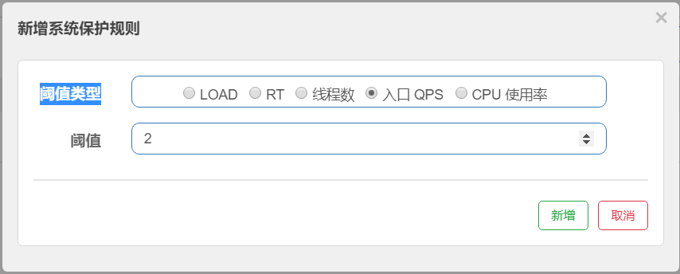


之后，通过浏览器输入http://localhost:8080/sys，慢速刷新，则持续显示”Hello Sentinel”；快速刷新则会交替出现”Hello Sentinel”和“Blocked by Sentinel (flow limiting)”。这说明系统自适应保护规则设置成功。

### 4.7.授权控制实现

很多时候，我们需要根据调用来源来判断该次请求是否允许放行，这时候可以使用 Sentinel 的来源访问控制（黑白名单控制）的功能。来源访问控制根据资源的请求来源（origin）判断资源访问是否通过，若配置白名单则只有请求来源位于白名单内时才可通过；若配置黑名单则请求来源位于黑名单时不通过，其余的请求通过。

**重要的属性**

来源访问控制规则（AuthorityRule）非常简单，主要有以下配置项：

- `resource`：资源名，即限流规则的作用对象。
- `limitApp`：请求来源，对应的黑名单/白名单，多个用","分隔，如 appA,appB。
- `strategy`：限制模式，AUTHORITY_WHITE为白名单模式，AUTHORITY_BLACK为黑名单模式，默认为白名单模式。

**这里演示实现Ip地址白名单和黑名单配置规则**

**实现步骤**

授权控制规则设置有两种方式

- 本地代码设置
- 在Sentinel控制台动态设置

**本地代码设置**

1.创建WhiteBlackController，在其中编写修改以下代码

```java
@RestController
public class WhiteBlackController {

    //定义限流资源和限流讲解回调函数
    @SentinelResource(value = "Sentinel_Rule", blockHandler = "exceptionHandler")
    @GetMapping("origin")
    public String hello() {
        return "Hello Sentinel!";
    }

    // blockHandler函数，原方法调用被限流/降级/系统保护的时候调用
    public String exceptionHandler(BlockException ex) {
        ex.printStackTrace();
        return "系统繁忙，请稍候";
    }

    /**
     * 白名单设置
     *
     * @PostConstruct ：在构造函数执行完毕后执行
     */
    @PostConstruct
    private static void initWhiteRules() {
        //1.创建存放授权规则的集合
        List<AuthorityRule> rules = new ArrayList<AuthorityRule>();

        //2.创建授权规则
        AuthorityRule rule = new AuthorityRule();
        //定义资源
        rule.setResource("Sentinel_Rule");
        //设置授权模式 RuleConstant.AUTHORITY_WHITE ：白名单
        rule.setStrategy(RuleConstant.AUTHORITY_WHITE);
        //设置白名单
        rule.setLimitApp("192.168.0.100");
        //将授权规则添加到集合中
        rules.add(rule);

        //3.加载授权规则
        AuthorityRuleManager.loadRules(rules);
    }

    /**
     * 黑名单设置
     *
     * @PostConstruct ：在构造函数执行完毕后执行
     */
    @PostConstruct
    private static void initBlackRules() {
        //1.创建存放授权规则的集合
        List<AuthorityRule> rules = new ArrayList<AuthorityRule>();

        //2.创建授权规则
        AuthorityRule rule = new AuthorityRule();
        //定义资源
        rule.setResource("Sentinel_Rule");
        //设置授权模式 RuleConstant.AUTHORITY_BLACK ：黑名单
        rule.setStrategy(RuleConstant.AUTHORITY_BLACK);
        //设置黑名单
        rule.setLimitApp("127.0.0.1");
        //将授权规则添加到集合中
        rules.add(rule);

        //3.加载授权规则
        AuthorityRuleManager.loadRules(rules);

    }
}
```

白名单和黑名单只要配置一个就可以满足需求。

2.创建SentinelConfig，设置请求来源解析

```java
@Component
public class SentinelConfig {
    @PostConstruct
    public void init(){
        //获取请求来源ip地址
        WebCallbackManager.setRequestOriginParser(new RequestOriginParser() {
            @Override
            public String parseOrigin(HttpServletRequest httpServletRequest) {
                return httpServletRequest.getRemoteAddr();
            }
        });
    }
}
```

3.运行测试

通过浏览器输入http://192.168.0.100:8080/origin进行访问，则显示”Hello Sentinel”；当浏览器输入http://127.0.0.1:8080/origin，则显示”系统繁忙，请稍候”，这说明授权控制规则设置成功。

**在Sentinel控制台动态设置**

将WhiteBlackController中的代码设置授权控制规则删除，重启项目，在Sentinel控制台动态设置授权控制规则。

在Sentinel控制台的左侧菜单中选择“授权规则”，点击“新增授权规则”按钮，增加白名单或者黑名单。

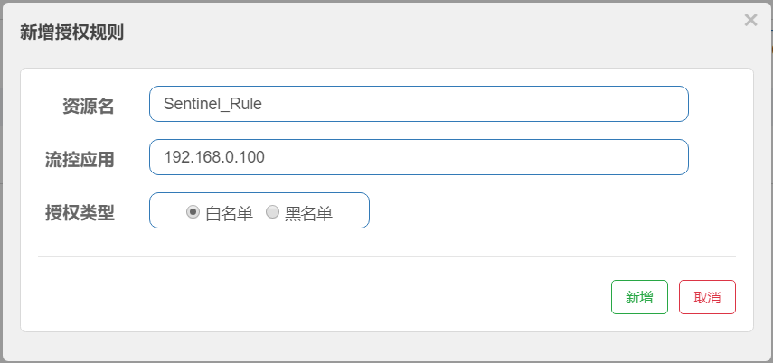

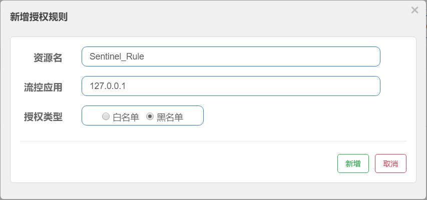

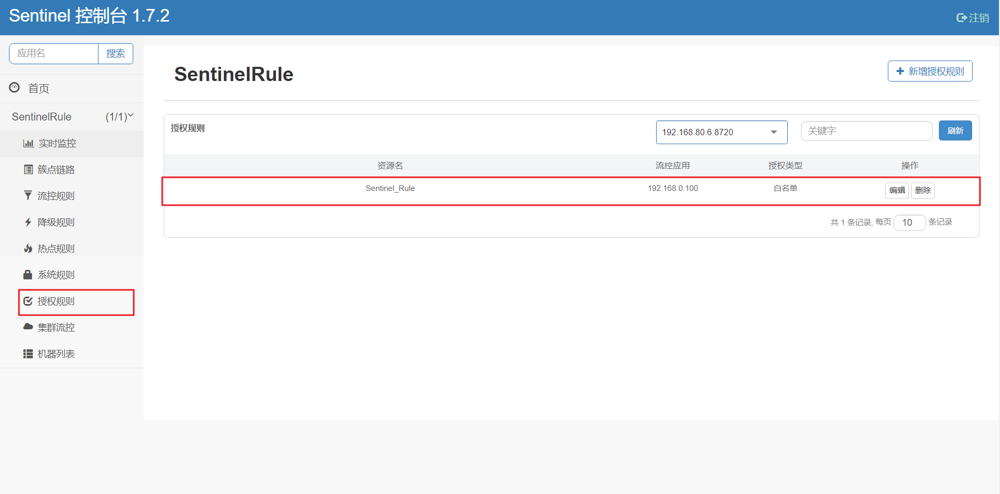

之后，通过浏览器输入http://192.168.0.100:8080/origin进行访问，则显示”Hello Sentinel”；当浏览器输入http://127.0.0.1:8080/origin，则显示”系统繁忙，请稍候”，这说明授权控制规则设置成功。

### 4.8.动态规则扩展实现

前面不管是通过Java代码还是通过Sentinel控制台的方式去设置限流规则，都属于手动方式，不够灵活。这种方式一般仅用于测试和演示，生产环境上一般通过动态规则源的方式来动态管理限流规则。也就是说，很多时候限流规则会被存储在文件、数据库或者配置中心当中。Sentinel的`DataSource` 接口给我们提供了对接任意配置源的能力。

官方推荐**通过控制台设置规则后将规则推送到统一的规则管理中心，客户端实现** `ReadableDataSource` **接口端监听规则中心实时获取变更**，流程如下：

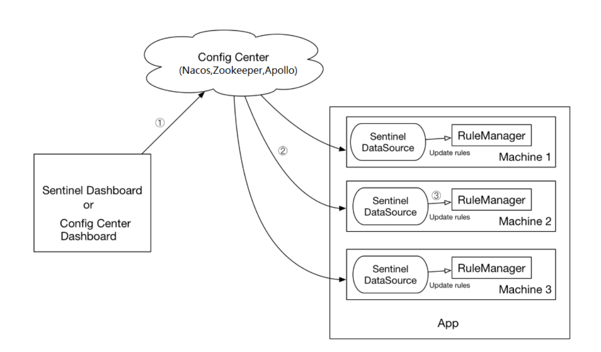

常见的实现方式有:

- **拉取式**：客户端主动向某个规则管理中心定期轮询拉取规则，这个规则管理中心可以是文件，甚至是 VCS 等。这样做的方式是简单，缺点是无法及时获取变更；实现拉模式的数据源最简单的方式是继承`AutoRefreshDataSource` 抽象类，然后实现 `readSource()`方法，在该方法里从指定数据源读取字符串格式的配置数据。
- **推送式**：规则管理中心统一推送，客户端通过注册监听器的方式时刻监听变化，比如使用 Zookeeper 、Apollo等作为规则管理中心。这种方式有更好的实时性和一致性保证。实现推模式的数据源最简单的方式是继承 `AbstractDataSource`抽象类，在其构造方法中添加监听器，并实现 `readSource()` 从指定数据源读取字符串格式的配置数据。

**这里演示如何使用zookeeper配置规则**

Sentinel 针对 ZooKeeper 作了相应适配，底层可以采用 ZooKeeper 作为规则配置数据源。使用时只需添加sentinel-datasource-zookeeper

1.新建工程sentinel_zookeeper，在pom.xml文件引入依赖

```xml
<!--Spring Cloud Alibaba Sentinel依赖-->
<dependency>
    <groupId>com.alibaba.cloud</groupId>
    <artifactId>spring-cloud-starter-alibaba-sentinel</artifactId>
    <version>2.1.0.RELEASE</version>
</dependency>

<!--sentinel适配zookeeper的依赖-->
<dependency>
     <groupId>com.alibaba.csp</groupId>
     <artifactId>sentinel-datasource-zookeeper</artifactId>
     <version>1.7.2</version>
</dependency>
```

2.在application.properties中配置连接sentinel控制台

```properties
# 设置应用的名称
spring.application.name=SentinelZookeeper
# 设置Sentinel连接控制台的主机地址和端口
spring.cloud.sentinel.transport.dashboard=localhost:9000
```

3.创建ZookeeperSentinelConfig，设置客户端修改获取规则的地方为从zookeeper获取规则。

```java
@Component
public class ZookeeperSentinelConfig {

    /**
     * 连接zookeeper获取规则
     */
    @PostConstruct
    public void loadRules(){
        //Zookeeper 服务端的连接地址
        String remoteAddress = "127.0.0.1:2181";
        //Zookeeper中的数据路径
        String path = "/Sentinel/zookeeper";


        //构建资源
        //参数1：zookeeper服务端地址
        //参数2：zookeeper数据路径
        //参数3：设置存放数据类型
        ReadableDataSource<String, List<FlowRule>> readableDataSource = new ZookeeperDataSource<>(
                remoteAddress,
                path,
                source -> JSON.parseObject(source, new TypeReference<List<FlowRule>>() {})
        );

        //将数据资源注册到FlowRuleManager
        FlowRuleManager.register2Property(readableDataSource.getProperty());
    }
}
```

4.创建ZookeeperController，设置流控资源配置

```java
@RestController
public class ZookeeperController {

    //定义限流资源和限流讲解回调函数
    @SentinelResource(value = "Sentinel_Zookeeper",blockHandler = "exceptionHandler")
    @GetMapping("zookeeper")
    public String hello() {

        return "Hello Sentinel!";
    }

    // blockHandler函数，原方法调用被限流/降级/系统保护的时候调用
    public String exceptionHandler(BlockException ex) {
        ex.printStackTrace();
        return "系统繁忙，请稍候";
    }
}
```

5.创建单元测试，编写代码，模拟往zookeeper中传递规则，然后再从客户端获取

```java
@RunWith(SpringRunner.class)
@SpringBootTest
public class SentinelZookeeperApplicationTests {

    @Test
    public void contextLoads() throws Exception {
        //zookeeper的服务端连接地址
        final String remoteAddress = "127.0.0.1:2181";

        //发送的规则
        //resource : 资源名
        //controlBehavior：流控效果
        //count：阀值
        //grade：规则类型
        //limitApp：调用来源
        //strategy：判断根据是资源自身，还是根据其他关联资源，还是根据链路入口
        final String rule = "[\n"
                + "  {\n"
                + "    \"resource\": \"Sentinel_Zookeeper\",\n"
                + "    \"controlBehavior\": 0,\n"
                + "    \"count\": 2.0,\n"
                + "    \"grade\": 1,\n"
                + "    \"limitApp\": \"default\",\n"
                + "    \"strategy\": 0\n"
                + "  }\n"
                + "]";
        //创建连接zookeeper
        CuratorFramework zkClient = CuratorFrameworkFactory.newClient(remoteAddress, new ExponentialBackoffRetry
                (1000, 3));
        //开始连接
        zkClient.start();
        //配置zookeeper数据路径
        String path = "/Sentinel/zookeeper";
        Stat stat = zkClient.checkExists().forPath(path);
        //发送数据给zookeeper
        if (stat == null) {
            zkClient.create().creatingParentContainersIfNeeded().withMode(CreateMode.PERSISTENT).forPath(path, null);
        }
        zkClient.setData().forPath(path, rule.getBytes());

        try {
            Thread.sleep(3000);
        } catch (InterruptedException e) {
            e.printStackTrace();
        }

        //关闭连接
        zkClient.close();

    }

}
```

6.运行测试

启动本地zookeeper。

启动项目，查看Idea打印台日志，查看项目是否连接了zookeeper。

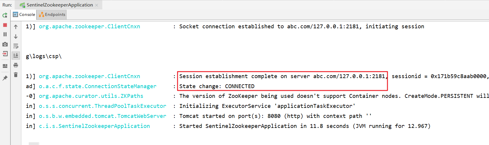

在浏览器输入http://localhost:8080/zookeeper，查看页面是否能显示请求返回的“Hello Sentinel!”。

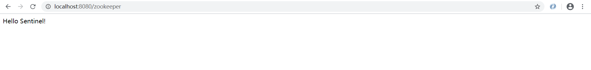

但是这个时候是没有流控规则的，也就是连续刷新，页面始终会显示“Hello Sentinel!”。

运行单元测试，向zookeeper发送流控规则，查看Idea打印台查看是否想zookeeper发送流控规则成功

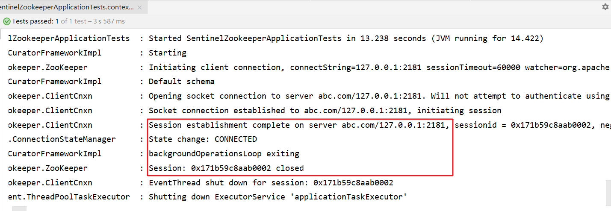

之后，在浏览器输入http://localhost:8080/zookeeper，慢速刷新，则持续显示”Hello Sentinel”；快速刷新则会交替出现”Hello Sentinel!”和“系统繁忙，请稍候”。这说明对资源限流成功。

## 5.Sentinel原理

### 5.1.Sentinel主要功能设计理念

#### 5.1.1.流量控制

流量控制在网络传输中是一个常用的概念，它用于调整网络包的发送数据。然而，从系统稳定性角度考虑，在处理请求的速度上，也有非常多的讲究。任意时间到来的请求往往是随机不可控的，而系统的处理能力是有限的。我们需要根据系统的处理能力对流量进行控制。Sentinel 作为一个调配器，可以根据需要把随机的请求调整成合适的形状，如下图所示：


**流量控制设计理念**

流量控制有以下几个角度:

- 资源的调用关系，例如资源的调用链路，资源和资源之间的关系；
- 运行指标，例如 QPS、线程池、系统负载等；
- 控制的效果，例如直接限流、冷启动、排队等。

Sentinel 的设计理念是让您自由选择控制的角度，并进行灵活组合，从而达到想要的效果。

#### 5.1.2.熔断降级

除了流量控制以外，及时对调用链路中的不稳定因素进行熔断也是 Sentinel 的使命之一。由于调用关系的复杂性，如果调用链路中的某个资源出现了不稳定，可能会导致请求发生堆积，进而导致级联错误。


Sentinel 和 Hystrix 的原则是一致的: 当检测到调用链路中某个资源出现不稳定的表现，例如请求响应时间长或异常比例升高的时候，则对这个资源的调用进行限制，让请求快速失败，避免影响到其它的资源而导致级联故障。


**熔断降级设计理念**

在限制的手段上，Sentinel 和 Hystrix 采取了完全不一样的方法。

Hystrix 通过线程池隔离的方式，来对依赖（在 Sentinel 的概念中对应资源）进行了隔离。这样做的好处是资源和资源之间做到了最彻底的隔离。缺点是除了增加了线程切换的成本（过多的线程池导致线程数目过多），还需要预先给各个资源做线程池大小的分配。

Sentinel 对这个问题采取了两种手段:

- 通过并发线程数进行限制

和资源池隔离的方法不同，Sentinel 通过限制资源并发线程的数量，来减少不稳定资源对其它资源的影响。这样不但没有线程切换的损耗，也不需要您预先分配线程池的大小。当某个资源出现不稳定的情况下，例如响应时间变长，对资源的直接影响就是会造成线程数的逐步堆积。当线程数在特定资源上堆积到一定的数量之后，对该资源的新请求就会被拒绝。堆积的线程完成任务后才开始继续接收请求。

- 通过响应时间对资源进行降级

除了对并发线程数进行控制以外，Sentinel 还可以通过响应时间来快速降级不稳定的资源。当依赖的资源出现响应时间过长后，所有对该资源的访问都会被直接拒绝，直到过了指定的时间窗口之后才重新恢复。

#### 5.1.3.系统负载保护

Sentinel 同时提供系统维度的自适应保护能力。防止雪崩，是系统防护中重要的一环。当系统负载较高的时候，如果还持续让请求进入，可能会导致系统崩溃，无法响应。在集群环境下，网络负载均衡会把本应这台机器承载的流量转发到其它的机器上去。如果这个时候其它的机器也处在一个边缘状态的时候，这个增加的流量就会导致这台机器也崩溃，最后导致整个集群不可用。

针对这个情况，Sentinel 提供了对应的保护机制，让系统的入口流量和系统的负载达到一个平衡，保证系统在能力范围之内处理最多的请求。

### 5.2.Sentinel的工作机制

Sentinel 的主要工作机制如下：

- 对主流框架提供适配或者显示的 API，来定义需要保护的资源，并提供设施对资源进行实时统计和调用链路分析。
- 根据预设的规则，结合对资源的实时统计信息，对流量进行控制。同时，Sentinel 提供开放的接口，方便您定义及改变规则。
- Sentinel 提供实时的监控系统，方便您快速了解目前系统的状态。