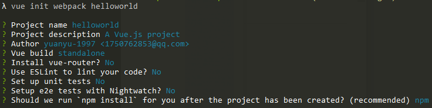

初始化一个vue项目
```
λ node -v                                                                               
v10.16.3  
λ npm -v                                                                                
6.13.4 
λ vue init webpack helloworld                                                           
```




进入项目目录

vue-i18n插件提供了国际化功能

```
cnpm install vue-i18n --save
```


```
vue-i18n插件和eslit有冲突，需要关闭eslint功能；修改 build\webpack.base.conf.js 文件
 ...(config.dev.useEslint ? [createLintingRule()] : [])
 ...(config.dev.useEslint ? [] : [])
```


```
npm run dev
```

