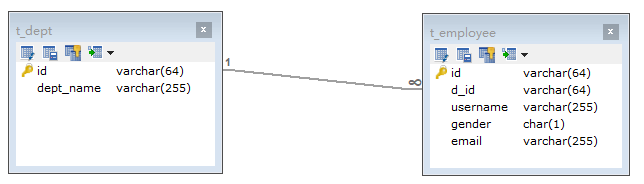

```sql
-- 插入
INSERT INTO t_dept(`id`, `dept_name`)
VALUES ('8848', '开发部'),
       ('6699', '测试部');
INSERT INTO t_employee(`id`, `d_id`, `username`, `gender`, `email`)
VALUES ('1', '8848', '张三', '0', 'zhangsan@bug.com'),
       ('2', '8848', '李四', '0', 'lisi@bug.com'),
       ('3', '8848', 'tom', '0', 'tom@bug.com');
-- 查询
SELECT * FROM t_employee;
SELECT * FROM t_dept;
```



