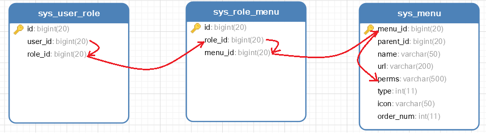

```bash
docker run \
--name renren_fast \
-e MYSQL_ROOT_HOST=%.%.%.% \
-e MYSQL_ROOT_PASSWORD=123456 \
-p 30000:3306  \
-di --rm mysql:8.0.18
```


```sql
jdbc:mysql://ip地址:30000/?serverTimezone=UTC
```


```sql
create database renren_fast default char set utf8mb4;
```





 https://blog.csdn.net/qq_39126213/article/details/106183467 