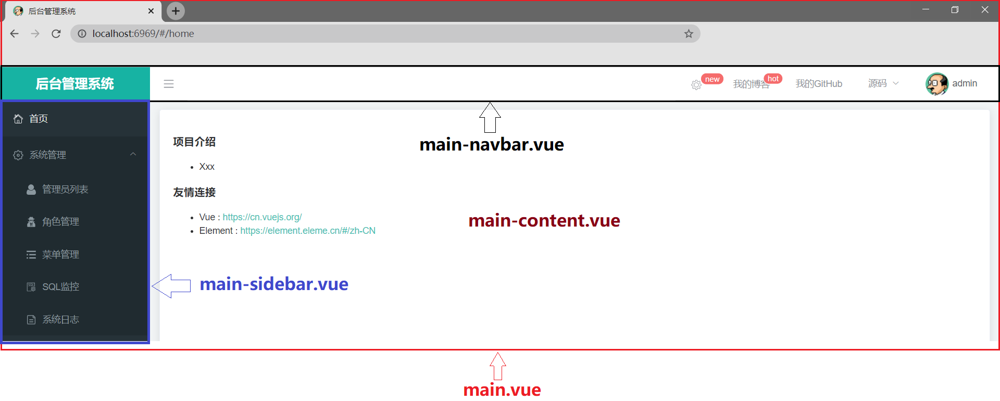
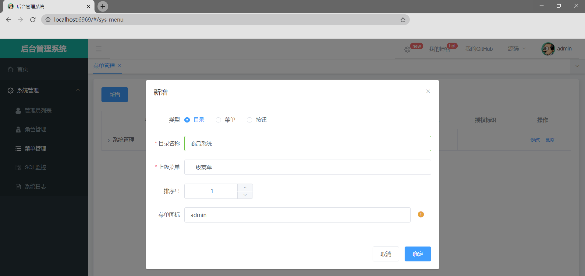
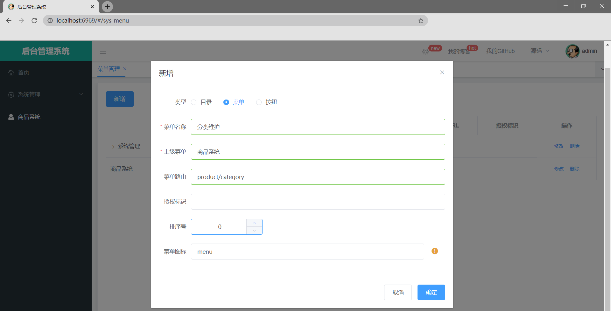
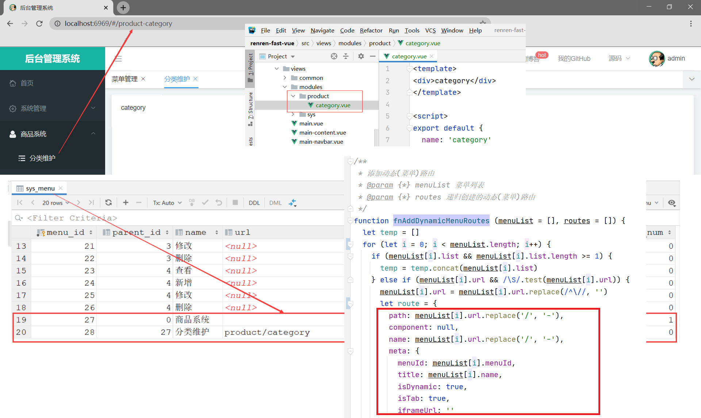
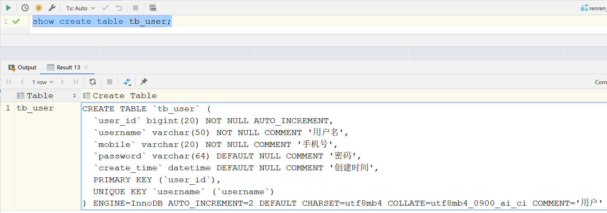
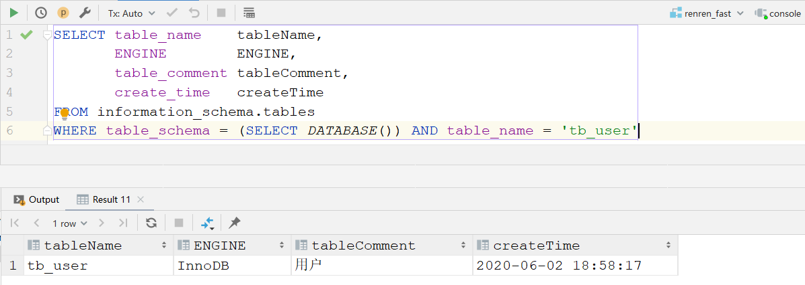
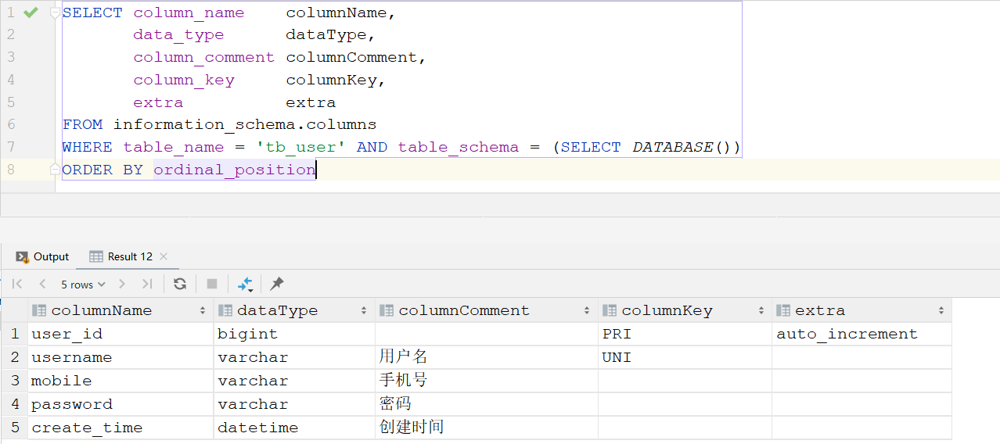

# 建库建表

```bash
docker run \
--name mysql_renren_fast \
-e MYSQL_ROOT_HOST=%.%.%.% \
-e MYSQL_ROOT_PASSWORD=123456 \
-p 30000:3306  \
-di --rm mysql:8.0.18
```

```
jdbc:mysql://121.36.33.154:30000/?serverTimezone=UTC
```

```sql
drop database if exists renren_fast;
create database renren_fast default char set utf8mb4;
use renren_fast;
```

# 核心表

```xml
<!--
	io.renren.modules.sys.dao.SysUserDao
-->

<!-- 查询用户的所有权限 -->
<select id="queryAllPerms" resultType="string">
    select m.perms
    from sys_user_role ur
             LEFT JOIN sys_role_menu rm on ur.role_id = rm.role_id
             LEFT JOIN sys_menu m on rm.menu_id = m.menu_id
    where ur.user_id = #{userId}
</select>
<!-- 查询用户的所有菜单ID -->
<select id="queryAllMenuId" resultType="long">
    select distinct rm.menu_id
    from sys_user_role ur
             LEFT JOIN sys_role_menu rm on ur.role_id = rm.role_id
    where ur.user_id = #{userId}
</select>
```


# 前端页面布局



# 添加目录或者菜单流程

添加目录



添加菜单



添加目录和菜单后会在后台的**sys_menu**表中生成对应的数据，前端页面按照对应的目录放置即可，前端页面放置位置参考添加菜单时填写的菜单路由

# 动态添加路由流程分析

用户登陆成功后，会触发路由前置守卫，如果没有添加路由信息就会从后端获取该用户所拥有的权限和菜单 io.renren.modules.sys.controller.SysMenuController#nav

```json
// http://localhost:1000/renren-fast/sys/menu/nav?t=1602227261263
{
    "msg": "success",
    "menuList": [
        {
            "menuId": 1,
            "parentId": 0,
            "parentName": null,
            "name": "系统管理",
            "url": null,
            "perms": null,
            "type": 0,
            "icon": "system",
            "orderNum": 0,
            "open": null,
            "list": [
                {
                    "menuId": 2,
                    "parentId": 1,
                    "parentName": null,
                    "name": "管理员列表",
                    "url": "sys/user",
                    "perms": null,
                    "type": 1,
                    "icon": "admin",
                    "orderNum": 1,
                    "open": null,
                    "list": null
                },
                {
                    "menuId": 3,
                    "parentId": 1,
                    "parentName": null,
                    "name": "角色管理",
                    "url": "sys/role",
                    "perms": null,
                    "type": 1,
                    "icon": "role",
                    "orderNum": 2,
                    "open": null,
                    "list": null
                }
                ...
            ]
        }
    ],
    "code": 0,
    "permissions": [
        "sys:user:list",
        "sys:menu:update",
        "sys:menu:delete",
        "sys:menu:save",
        ...
    ]
}
```

前端会根据后端返回的数据，在路由前置守卫中判断是否已经添加过动态添加路由信息，如果没有会调用fnAddDynamicMenuRoutes(data.menuList)来添加动态路由 **src/router/index.js** 

```json
[ // 调用fnAddDynamicMenuRoutes传入的data.menuList，动态添加路由信息
    {
        "menuId": 1,
        "parentId": 0,
        "parentName": null,
        "name": "系统管理",
        "url": null,
        "perms": null,
        "type": 0,
        "icon": "system",
        "orderNum": 0,
        "open": null,
        "list": [ // fnAddDynamicMenuRoutes里面的temp变量
            {
                "menuId": 2,
                "parentId": 1,
                "parentName": null,
                "name": "管理员列表",
                "url": "sys/user",
                "perms": null,
                "type": 1,
                "icon": "admin",
                "orderNum": 1,
                "open": null,
                "list": null
            },
            {
                "menuId": 3,
                "parentId": 1,
                "parentName": null,
                "name": "角色管理",
                "url": "sys/role",
                "perms": null,
                "type": 1,
                "icon": "role",
                "orderNum": 2,
                "open": null,
                "list": null
            }
            ...
        ]
    }
]
```

```javascript
router.beforeEach((to, from, next) => {
  // 添加动态(菜单)路由
  // 1. 全局路由 or 已经添加, 直接访问
  // 2. 获取菜单列表, 添加并保存本地存储
  if (router.options.isAddDynamicMenuRoutes || fnCurrentRouteType(to, globalRoutes) === 'global') {
    next()
  } else {
    http({
      url: http.adornUrl('/sys/menu/nav'),
      method: 'get',
      params: http.adornParams()
    }).then(({data}) => {
      if (data && data.code === 0) {
        fnAddDynamicMenuRoutes(data.menuList)
        router.options.isAddDynamicMenuRoutes = true
        sessionStorage.setItem('menuList', JSON.stringify(data.menuList || '[]')) // 后面渲染侧边栏需要
        sessionStorage.setItem('permissions', JSON.stringify(data.permissions || '[]'))
        next({...to, replace: true})
      } else {
        sessionStorage.setItem('menuList', '[]')
        sessionStorage.setItem('permissions', '[]')
        next()
      }
    }).catch((e) => {
      console.log(`%c${e} 请求菜单列表和权限失败，跳转至登录页！！`, 'color:blue')
      router.push({name: 'login'})
    })
  }
})
```

```javascript
/**
 * 添加动态(菜单)路由
 * @param {*} menuList 菜单列表
 * @param {*} routes 递归创建的动态(菜单)路由
 */
function fnAddDynamicMenuRoutes(menuList = [], routes = []) {
  let temp = []
  for (let i = 0; i < menuList.length; i++) {
    if (menuList[i].list && menuList[i].list.length >= 1) {
      temp = temp.concat(menuList[i].list)
    } else if (menuList[i].url && /\S/.test(menuList[i].url)) { // url不为空，菜单
      // {"menuId":6,"parentId":1,"parentName":null,"name":"系统日志","url":"sys/log","perms":"sys:log:list","type":1,"icon":"log","orderNum":7,"open":null,"list":null}
      menuList[i].url = menuList[i].url.replace(/^\//, '')
      const route = {
        path: menuList[i].url.replace('/', '-'),
        component: null,
        name: menuList[i].url.replace('/', '-'),
        meta: {
          menuId: menuList[i].menuId,
          title: menuList[i].name,
          isDynamic: true,
          isTab: true,
          iframeUrl: ''
        }
      }
      // url以 http[s]:// 开头，通过iframe展示
      if (isURL(menuList[i].url)) {
        route['path'] = `i-${menuList[i].menuId}`
        route['name'] = `i-${menuList[i].menuId}`
        route['meta']['iframeUrl'] = menuList[i].url
      } else {
        try {
          // 导入组件
          route['component'] = _import(`modules/${menuList[i].url}`) || null
        } catch (e) {
        }
      }
      // 添加一个路由
      routes.push(route)
    }
  }
  // menuList[i].list不为空还要递归
  if (temp.length >= 1) {
    fnAddDynamicMenuRoutes(temp, routes)
  } else {
    mainRoutes.name = 'main-dynamic'
    mainRoutes.children = routes
    router.addRoutes([
      mainRoutes,
      {path: '*', redirect: {name: '404'}}
    ])
    sessionStorage.setItem('dynamicMenuRoutes', JSON.stringify(mainRoutes.children || '[]')) // 这里用于后面渲染导航栏用
    console.log('\n')
    console.log('%c!<-------------------- 动态(菜单)路由 s -------------------->', 'color:blue')
    // console.log(mainRoutes.children)
    console.log(router)
    console.log('%c!<-------------------- 动态(菜单)路由 e -------------------->', 'color:blue')
  }
}
```

```html
<!--
	src/views/main-sidebar.vue
-->
<!-- 动态加载 -->
<sub-menu
  v-for="menu in menuList"
  :key="menu.menuId"
  :menu="menu"
  :dynamicMenuRoutes="dynamicMenuRoutes">
</sub-menu>
<script>
created () {
  this.menuList = JSON.parse(sessionStorage.getItem('menuList') || '[]')
  this.dynamicMenuRoutes = JSON.parse(sessionStorage.getItem('dynamicMenuRoutes') || '[]') 
  this.routeHandle(this.$route)
}
</script>
```


# 验证码登陆流程

前端在获取验证码的时候会传递一个uuid给后端

```javascript
// src/views/common/login.vue

export default {
	data () {
	  return {
		captchaPath: ''
	  }
	},
	created () {
	  this.getCaptcha() // 获取二维码
	},
	methods: {
	  // 获取验证码
	  getCaptcha () {
		this.dataForm.uuid = getUUID()
		this.captchaPath = this.$http.adornUrl(`/captcha.jpg?uuid=${this.dataForm.uuid}`)
	  }
	}
}

// src/utils/index.js
/**
 * 获取uuid
 */
function getUUID() {
  return 'xxxxxxxx-xxxx-4xxx-yxxx-xxxxxxxxxxxx'.replace(/[xy]/g, c => {
    return (c === 'x' ? (Math.random() * 16 | 0) : ('r&0x3' | '0x8')).toString(16)
  })
}
```
后端生成验证码的时候会把这个**uuid+code**存入数据库
```java
// io.renren.modules.sys.controller.SysLoginController#captcha
@GetMapping("captcha.jpg")
public void captcha(HttpServletResponse response, String uuid) throws IOException {
    response.setHeader("Cache-Control", "no-store, no-cache");
    response.setContentType("image/jpeg");
    // 获取图片验证码
    BufferedImage image = sysCaptchaService.getCaptcha(uuid);
    ServletOutputStream out = response.getOutputStream();
    ImageIO.write(image, "jpg", out);
    IOUtils.closeQuietly(out);
}

//io.renren.modules.sys.service.impl.SysCaptchaServiceImpl#getCaptcha
@Override
public BufferedImage getCaptcha(String uuid) {
	if (StringUtils.isBlank(uuid)) {
		throw new RRException("uuid不能为空");
	}
	//生成文字验证码
	String code = producer.createText();
	SysCaptchaEntity captchaEntity = new SysCaptchaEntity();
	captchaEntity.setUuid(uuid);
	captchaEntity.setCode(code);
	// 5分钟后过期
	captchaEntity.setExpireTime(DateUtils.addDateMinutes(new Date(), 5));
	this.save(captchaEntity); // 保存到sys_captcha表中
	return producer.createImage(code);
}
```

在用户登陆的时候会根据**uuid+code**来确定用户输入的验证码是否正确

```sql
// io.renren.modules.sys.controller.SysLoginController#login
@PostMapping("/sys/login")
public Map<String, Object> login(@RequestBody SysLoginForm form) {
	boolean captcha = sysCaptchaService.validate(form.getUuid(), form.getCaptcha());
	if (!captcha) {
		return R.error("验证码不正确");
	}
	//用户信息
	SysUserEntity user = sysUserService.queryByUserName(form.getUsername());
	//账号不存在、密码错误
	if (user == null || !user.getPassword().equals(new Sha256Hash(form.getPassword(), user.getSalt()).toHex())) {
		return R.error("账号或密码不正确");
	}
	//账号锁定
	if (user.getStatus() == 0) {
		return R.error("账号已被锁定,请联系管理员");
	}
	//生成token，并保存到数据库
	return sysUserTokenService.createToken(user.getUserId());
}

// io.renren.modules.sys.service.impl.SysCaptchaServiceImpl#validate
@Override
public boolean validate(String uuid, String code) {
	// 通过uuid+code找到这条记录，来判断用户验证码输入是否正确
	SysCaptchaEntity captchaEntity = this.getOne(new QueryWrapper<SysCaptchaEntity>().eq("uuid", uuid)); 
	if (captchaEntity == null) {
		return false;
	}
	//删除验证码
	this.removeById(uuid);
	if (captchaEntity.getCode().equalsIgnoreCase(code) && captchaEntity.getExpireTime().getTime() >= System.currentTimeMillis()) {
		return true;
	}
	return false;
}
```

# 代码生成器原理

代码生成器原理很简单，反向分析数据库的表信息，然后填充模板文件即可

```xaml
<mapper namespace="io.renren.dao.MySQLGeneratorDao">
</mapper>
```


## 查看表信息

```sql
SELECT table_name    tableName,
       ENGINE        ENGINE,
       table_comment tableComment,
       create_time   createTime
FROM information_schema.tables
WHERE table_schema = (SELECT DATABASE()) AND table_name = 'tb_user'
```



## 查看表字段信息

```sql
SELECT column_name    columnName,
       data_type      dataType,
       column_comment columnComment,
       column_key     columnKey,
       extra          extra
FROM information_schema.columns
WHERE table_name = 'tb_user' AND table_schema = (SELECT DATABASE())
ORDER BY ordinal_position
```




- https://blog.csdn.net/qq_39126213/article/details/106183467 

- https://zhuanlan.zhihu.com/p/100414292

