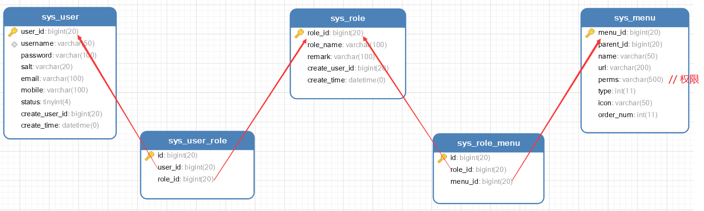

```bash
docker run \
--name mysql_renren_fast \
-e MYSQL_ROOT_HOST=%.%.%.% \
-e MYSQL_ROOT_PASSWORD=123456 \
-p 30000:3306  \
-di --rm mysql:8.0.18
```

```sql
jdbc:mysql://ip地址:30000/?serverTimezone=UTC
```

```sql
drop database if exists renren_fast;
create database renren_fast default char set utf8mb4;
use renren_fast;
```


```xml
<!-- 查询用户的所有权限 -->
<select id="queryAllPerms" resultType="string">
    select m.perms
    from sys_user_role ur
             LEFT JOIN sys_role_menu rm on ur.role_id = rm.role_id
             LEFT JOIN sys_menu m on rm.menu_id = m.menu_id
    where ur.user_id = #{userId}
</select>
```

```xml
<!-- 查询用户的所有菜单ID -->
<select id="queryAllMenuId" resultType="long">
    select distinct rm.menu_id
    from sys_user_role ur
             LEFT JOIN sys_role_menu rm on ur.role_id = rm.role_id
    where ur.user_id = #{userId}
</select>
```




 https://blog.csdn.net/qq_39126213/article/details/106183467 