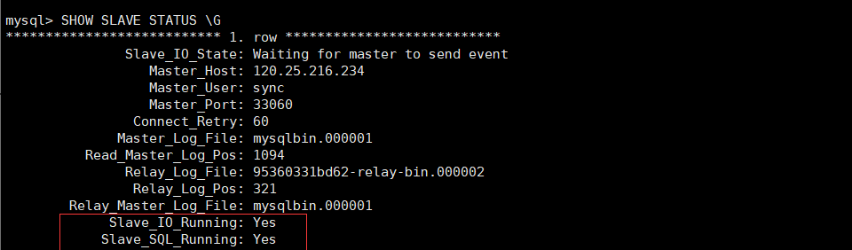
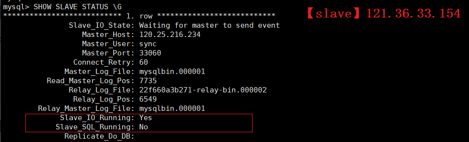

# 【master】120.25.216.234

使用docker创建一个mysql容器

```bash
docker run \
--name master_db \
--env MYSQL_ROOT_HOST=%.%.%.% \
--env MYSQL_ROOT_PASSWORD=123456 \
-p 33060:3306  \
-di mysql:8.0.18
```

进入容器并修改配置文件

```bash
docker exec -it master_db /bin/bash
https://blog.csdn.net/qq_40794973/article/details/103984182
vi /etc/mysql/my.cnf
```

```properties
#mysql 服务ID，保证整个集群环境中唯一
server-id=1
#mysql binlog 日志的存储路径和文件名
log-bin=/var/lib/mysql/mysqlbin
#是否只读，1 代表只读，0 代表读写
read-only=0
#忽略的数据，指不需要同步的数据库
binlog-ignore-db=mysql
```

****

退出容器后重启容器

```bash
docker restart master_db
```

使用远程工具连接配置好的master

```
jdbc:mysql://120.25.216.234:33060/?serverTimezone=UTC
```

创建同步数据的账户，并且进行授权操作（注意**ip地址为slave数据库的ip地址**）

```bash
CREATE USER 'sync'@'121.36.33.154' IDENTIFIED WITH mysql_native_password BY '123456';
GRANT REPLICATION SLAVE ON *.* TO 'sync'@'121.36.33.154';
FLUSH PRIVILEGES;
```

查看master状态

```bash
mysql> SHOW MASTER STATUS;
+-----------------+----------+--------------+------------------+-------------------+
| File            | Position | Binlog_Do_DB | Binlog_Ignore_DB | Executed_Gtid_Set |
+-----------------+----------+--------------+------------------+-------------------+
| mysqlbin.000001 |     1094 |              | mysql            |                   |
+-----------------+----------+--------------+------------------+-------------------+
1 row in set (0.00 sec)
```

# 【slave】121.36.33.154

创建docker容器
```bash
docker run \
--name slave_db \
--env MYSQL_ROOT_HOST=%.%.%.% \
--env MYSQL_ROOT_PASSWORD=123456 \
-p 33000:3306  \
-di mysql:8.0.18
```
和前面一样修改容器里面的配置文件
```bash
docker exec -it slave_db /bin/bash
https://blog.csdn.net/qq_40794973/article/details/103984182
vi /etc/mysql/my.cnf
```
```properties
#mysql服务端ID,唯一
server-id=2
#指定binlog日志
log-bin=/var/lib/mysql/mysqlbin
```


同样退出容器重启

```bash
docker restart slave_db
```

使用远程工具连接配置好的slave

```
jdbc:mysql://121.36.33.154:33000/?serverTimezone=UTC
```

配置同步（注意**ip地址是master的ip地址**）

```bash
CHANGE MASTER TO 
MASTER_HOST = '120.25.216.234',
MASTER_PORT = 33060,
MASTER_USER = 'sync',
MASTER_PASSWORD = '123456',
MASTER_LOG_FILE = 'mysqlbin.000001',
MASTER_LOG_POS = 1094 ;
```

开启同步操作

```bash
START SLAVE;
```

```bash
SHOW SLAVE STATUS \G
```



停止同步操作

```
STOP SLAVE;
```

在slave创建一个只有查询权限的用户，可以避免很多问题发生

```bash
CREATE USER  'tms_select'@'%.%.%.%' IDENTIFIED WITH mysql_native_password BY '123456';
GRANT select ON *.* TO 'tms_select'@'%.%.%.%';
FLUSH PRIVILEGES;
```

```bash
jdbc:mysql://121.36.33.154:33000/?serverTimezone=UTC
```

# 测试主从同步

在master创建表并插入数据

 https://blog.csdn.net/qq_40794973/article/details/104831325 

````sql
CREATE DATABASE easycode_db;
USE easycode_db;

CREATE TABLE `user`(
    `id`       INT(10) UNSIGNED NOT NULL,
    `username` varchar(20)  DEFAULT NULL,
    `password` varchar(50)  DEFAULT NULL,
    `sex`      varchar(2)   DEFAULT NULL,
    `birthday` date         DEFAULT NULL,
    `address`  varchar(100) DEFAULT NULL,
    PRIMARY KEY (`id`)
);

INSERT INTO `user`(`id`, `username`, `password`, `sex`, `birthday`, `address`)
VALUES (1, '蔡徐坤','123','男',NOW(),'Xxxx'),
       (2, '乔碧萝','321','女',NOW(),'Xxxx'),
       (3, '卢本伟','456','男',NOW(),'Xxxx');
SELECT * FROM `user`;
````

在slave即可查看master创建的数据库和表以及插入的数据

```sql
SELECT * FROM easycode_db.`user`;
```


```
【master】jdbc:mysql://120.25.216.234:33060/easycode_db?serverTimezone=UTC
【slave】jdbc:mysql://121.36.33.154:33000/easycode_db?serverTimezone=UTC
```

# 主从复制失败

```bash
stop slave;
reset master;
```

https://blog.csdn.net/abcwanglinyong/article/details/96563085 

配置好主从复制后如果**删除从表记录**，会造成主从复制失败；




 https://www.oschina.net/question/2398274_2262571 

```properties
log-error=/usr/local/mysql/data/mysql.log  
```

