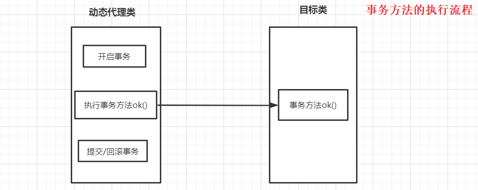
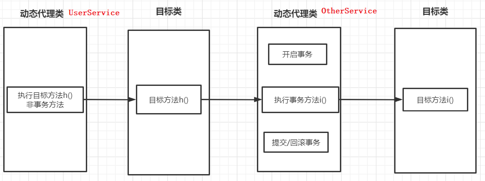

**没有事务的方法**调用**有事务的方法**，两个方法在同一个类中，事务方法是不会生效的

事务是代理类添加上去的，如果我们调用的方法不带事务注解，此时代理类不开启事务，而是直接调用目标对象的方法；当进入目标对象的方法后，执行的上下文已经变成对目标对象本身的调用，此时再调用带事务注解的方法，依然没有事务，只是一个普通的方法调用

------

**没有事务的方法**调用**有事务的方法**，两个方法在同不同类中，事务方法生效

------

只要是以代理方式实现的声明式事务，无论是JDK动态代理，还是CGLIB直接写字节码生成代理，都只有 **public** 方法上的事务注解才起作用，而且必须在代理类外部调用才行，如果直接在目标类里面调用，否则事务依然不起作用

SSM整合过程也可能出现事务失效的问题

 https://blog.csdn.net/qq_32588349/article/details/52097943 