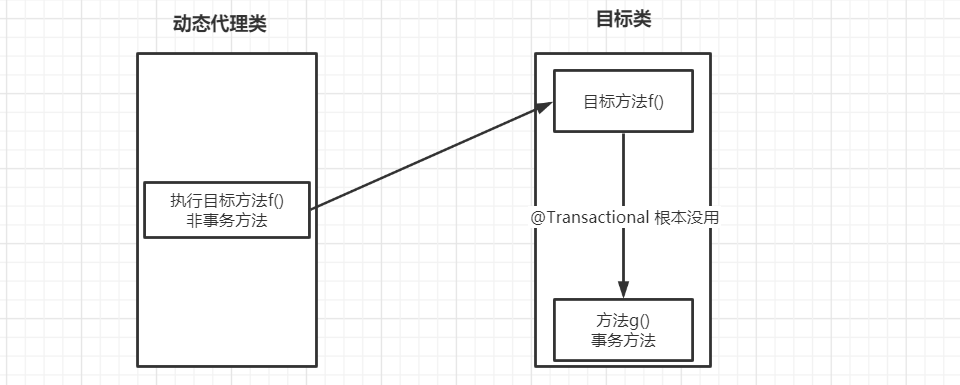

# 1 数据准备

 https://blog.csdn.net/qq_40794973/article/details/104831325 

```bash
docker run \
--name mysql_tx \
--env MYSQL_ROOT_HOST=%.%.%.% \
--env MYSQL_ROOT_PASSWORD=123456 \
-p 60000:3306  \
-di mysql:8.0.18
```

```
jdbc:mysql://121.36.33.154:60000?serverTimezone=UTC
```

```sql
-- 创建数据库
drop database if exists db_tx_test;
create database db_tx_test default char set utf8mb4;
use db_tx_test;
-- 创建测试表
CREATE TABLE `tb_user`
(
    `id`       INT(10) UNSIGNED AUTO_INCREMENT COMMENT '主键ID',
    `username` VARCHAR(20) NOT NULL COMMENT '用户名',
    `password` VARCHAR(64) NOT NULL COMMENT '密码',
    `name`     VARCHAR(20) COMMENT '姓名',
    `age`      TINYINT UNSIGNED COMMENT '年龄',
    `email`    VARCHAR(50) COMMENT '邮箱',
    PRIMARY KEY `id` (`id`),
    UNIQUE KEY `uk_user_username` (`username`)
);
```


# 2 同一个类中没有事务的方法调用有事务的方法

**没有事务的方法**调用**有事务的方法**，**两个方法在同一个类**中，事务方法是**不会生效**的


事务是代理类添加上去的，如果我们调用的方法不带事务注解，此时代理类不开启事务，而是直接调用目标对象的方法；当进入目标对象的方法后，执行的上下文已经变成对目标对象本身的调用，此时再调用带事务注解的方法，依然没有事务，只是一个普通的方法调用



------

# 3 不同类中没有事务的方法调用有事务的方法

**没有事务的方法**调用**有事务的方法**，**两个方法在同不同类中**，事务方法**生效**


------

# 4 只有public方法事务才起作用

只要是以代理方式实现的声明式事务，无论是JDK动态代理，还是CGLIB直接写字节码生成代理，都只有 **public** 方法上的事务注解才起作用，而且**必须在代理类外部调用**才行，如果直接在目标类里面调用，否则事务依然不起作用

# 5 SSM整合父子上下文重复扫描事务失效

SSM整合过程也可能出现事务失效的问题：https://blog.csdn.net/qq_32588349/article/details/52097943 

